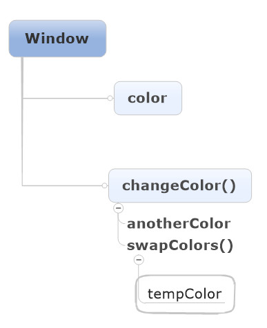

# Javascript

- EMCAScript：解释器、翻译


- DOM：Document Object Model


- BOM：Browsert Object Model
----

- [x] ？？？理解对象和object


- [x] ？？？位操作符中的32位符号
- [ ] 字符编码？比较字符编码"23"<"3"
- [ ] 4.2.1延长作用域链
- [ ] 5.2.8forEach（）

## 第一章：简介

1.出现、版本更新

ECMAScript，由ECMA-262定义，提供核心语言功能；

#### 2.文档对象模型（Document Object Model）
是针对XML但是经过扩展用于HTML的应用程序编程接口（API）

DOM把整个页面映射为一个多节点结构→开发人员获得控制页面和结构的主动权

**提供访问和操作网页内容的方法和接口**

#### 3.浏览器对象模型（BOM）
控制浏览器显示的页面以外的部分

**提供与浏览器交互的方法和接口**

## 第二章：在HTML中使用JavaScript

#### <\script>元素

1.插入方法

- ```
  <script type="text/javascript">
    function sayHi(){
       alert("Hi");
    }
   </script>
  嵌入js代码
  ```


- ```
  <sript type="text/javascript" src="example.js"></script>
  导入外部js
  ```

2.解析顺序

- defer属性：延迟脚本，**立即下载但延迟执行**解析和显示后执行（只对外部脚本有效）


- async属性：异步脚本，立即下载，不影响其他操作（只对外部脚本有效）**目的不让页面等待两个脚本下载和执行，从而异步加载页面其他内容**，表示当前脚本不必等待其他脚本
- 除此之外，浏览器会按照<script>*在页面的先后顺序依次解析*

3.标签的位置

多放在body元素中页面内容的后面

4.在XHTM中的用法

*CData*片段包含JavaScript代码，表示区域内不解析

```
<script>//<![CDATA[
    function{...}
        //]]>
</script>
//注释是为了不兼容XHTML的浏览器
```

## 第三章：基本概念

#### 1.语法

1.1区分大小写

1.2标识符：指变量、函数、属性的名字，或者函数的参数

- 第一个字母必须是一个字母、下划线_、或者一个$
- 其他字符除以上三者还可以是数字
- 惯例驼峰大小写格式、第一个字母小写，剩下每个单词首字母大写

1.3注释

//单行注释

/*多行

注释*/

1.4严格模式

在顶部添加代码“use strict”告诉引擎切换到严格模式

1.5语句    ①分号句尾②使用代码块{}

#### 2.关键字和保留字

不能作为标识符

#### 3.变量

3.1ECMAScript的变量是松散型的，就是可以用来保存任何类型的数据；换句话说，每个变量仅仅是一个用于保留值得占位符而已

3.2

var message；//未初始化变量，值为undefined

var message=“hi";//初始化变量，赋值

3.3**使用var操作符定义的变量将成为定义该变量作用域的局部变量，函数退出即销毁**

省略var，即为全局变量，不推荐使用

```
fuancion text{
    message="hi";//全局变量
}
text();//调用函数
alert(message);//hi
```

3.4可以使用一条语句定义多个变量

#### 4.数据类型

①五种基本数据类型（简单数据类型）

- Undefined→undefined

- Null→object

- Boolean→

- Number

- String

②一种复杂数据类型

- Object:一组无序的名值对组成

③不支持任何创建的自定义类型，所以值都是上述六种之一

##### 4.1 typeof操作符

**检测给定变量的数据类型**

###### 可能返回的字符串

- undefined

- boolean

- string

- numble

- object:这个值是对象（*?*）或者null

- function：函数


typeof是一个*操作符*而不是函数，所以可以alert（typeof(message));//string;圆括号可以用但是却不是必须的

function函数在ECMAScript中是**对象**，不是数据类型

通过typeof操作符来区分函数和其他对象

##### 4.2 Undefined类型

- 使用var声明变量但是未对其加以初始化，默认取得undefined值
- var message=undefned,使用undefined显示初始化变量（没必要）
- 未声明的变量，typeof操作符同样返回undefined值

##### 4.3 Null类型

①从逻辑角来看，null值表示一个*空对象指针*，这也是typeof操作符检测null值会**返回“object”**的原因.

②如果定义的变量准备在将来用来保存对象，那么最好初始化为null，而不是其他；

③实际上，undefined是派生自null值的，所以他们的相等性测试返回true；

④尽管二者有这样的关系，但是用法却完全不同。初始化undefined没必要，初始化null却是有必要的；这可以提现null作为空对象指针惯例，也进一步*区分*null和undefined。

##### 4.4 Bollean类型

- 只有两个字面值true和false；区分大小写，只有小写才是布尔值，不然只是标识符；
- 虽然字面值只有两个，但是ECMAScript中所有类型的值都有与这两个Boolean值等价的值

| 数据类型      | 转换为true的值           | 转换为false的值 |
| --------- | ------------------- | ---------- |
| Boolean   | true                | false      |
| String    | 任何非空字符串             | “”（空字符串）   |
| Number    | 任何非零数字值（包括无穷大)      | 0和NAN      |
| Object    | 任何对象                | null       |
| Undefined | n/a(not applicable) | undefined  |

##### 4.5 Numble类型：

表示整数和浮点数值

（一）数值字面量格式

①最基本的数据字面量格式：十进制整数

②八进制：第一位是0,然后八进制数字序列（0-7）

③十六进制：第一位是0x，然后（0-9及A-F）

如果字面值中的数值超出范围，则前导0被忽略，按照十进制解析

（二）浮点数值

由于浮点数值需要的内存空间是保存整数值得两倍，所以如果能转换为整数的数值将转换为整数保存

科学计数法e表示法

浮点数值的最高精度为17位，但是进行算数计数时精度远不如整数

例如0.1+0.2=0.300000000000004，舍入误差

因此*永远不要测试某个特定的浮点数值*

（三）数值范围

MAX_VALUE 属性是 JavaScript 中可表示的最大的数。它的近似值为 1.7976931348623157 x 10308

MIN_VALUE 属性是 JavaScript 中可表示的最小的数（接近 0 ，但不是负数）。它的近似值为 5 x 10-324

如果得到一个超出JavaScript数值范围的值，则被转换成Infinity

负数则被转换成-Infinity(负无穷)

**Infinity不能参与计算**

可以使用*isFinite（）函数*   确定数值是不是有穷的，如果是，返回true

```javascript
var result=Number.MAX_VALUE+1;

alert(isFinite(result));//false
```

在执行极小或者极大数值的计算时，要检测监控这些值

（四）NaN

Not a Numble非数值，是一个特殊的数值；这样ECMAScript就不会抛出错误，不会影响其他代码的执行；

- 任何涉及NaN的操作都会返回NaN；
- NaN与任何值都不相等，包括NaN本身；
- 0除以0返回NaN，整数除以NaN返回Infinity，负数除以0返回-Infinity

*isNaN（）函数*    确定参数是否“不是数值”，函数接受一个数值会尝试转换成数值，如果不能转换成数值，函数返回true

```javascript
alert(NaN == NaN);       //false
alert(isNaN(NaN));       //true
alert(isNaN(10));        //false – 10 is a number
alert(isNaN("10"));      //false – can be converted to number 10
alert(isNaN("blue"));    //true – cannot be converted to a number
alert(isNaN(true));      //false – can be converted to number 1
```

（五）数值转换

- Number（）：用于*任何数据*类型

  ```javascript
   var num1 = Number("Hello world!");  //NaN
   var num2 = Number("");              //0
   var num3 = Number("000011");        //11
   var num4 = Number(true);            //1
   var num5 = Number(null);            //0
   var num6 = Number(undefined);       //NaN
   var num7 = Number(0xA);             //10
  ```

- parseInt（）：专门用于把*字符串*转换成数值

  由于Number（）函数在转换字符串时比较复杂和不够合理，因此在处理整数时更常用parseInt（）函数；

  忽略前面的空格，找到第一个**非空格字符**

```javascript
  var num1 = parseInt("1234blue"); //1234
  var num2 = parseInt("");        //NaN
  var num3 = parseInt("0xA");     //10 - hexadecimal
  var num4 = parseInt(22.5);      //22 -小数点不是有效的                                     数字字符
  var num5 = parseInt("070");     //70 - decimal
  var num6 = parseInt("0xf");    //15 – hexadecimal
  var num7 = parseInt("blue123"); //NaN
```

ECMAScript3认为“070”是56（八进制），而ECMAScript5以后被认为是十进制，所以parseInt（）函数以不具备解析八进制的能力了

为解决这个问题，可以为函数提供第二个参数：转换时使用的基数

```javascript
 var num1 = parseInt("AF", 16);        //175
 var num2 = parseInt("AF");            //NaN
 如果指定了16作为基数，则可以不带"0x"
 var num3 = parseInt("10", 10);        //10 – parsed                                          as decimal
 var num4 = parseInt("10", 2);         //2 – parsed                                            as binary
```

不指定基数意味着让函数决定如何解析输入的字符，因此为了避免错误解析，我们建议**无论什么情况下都明确指定基数**

- parseFloat（）：专门用于把*字符串*转换成数值，有小数

*区别*：

①第一个小数点有效；

②始终会忽略前导的0；

③只解析十进制，十六进制始终被转换成0；

```
var num1 = parseFloat("1234blue");   //1234 - integer
var num2 = parseFloat("0xA");         //0
var num4 = parseFloat("22.34.5");     //22.34
var num5 = parseFloat("0908.5");      //908.5
var num6 = parseFloat("3.125e7");     //31250000
var num7 = parseFloat(1.000);        //1
```

#####4.6 String类型 

用于表示由0个或者多个16位Unicode字符组成的字符序列，及*字符串*。　　

【Unicode编码：一个英文等于两个字节，一个中文（含繁体）等于两个字节。16位指的是：字符串每个字符所占用的空间为16bits 比特(2 bytes字节)】

双引号和单引号的字符写法在ECMAScript中完全相同

（一）字符字面量

String数据类型包含一些特殊的字符字面量，也叫专业序列；

| 字面量   | 含义                                     |
| ----- | -------------------------------------- |
| \n    | 换行                                     |
| \t    | 制表                                     |
| \b    | 空格                                     |
| \r    | 回车                                     |
| \f    | 进纸                                     |
| \\    | 斜杠                                     |
| \'    | 单引号                                    |
| \"    | 双引号                                    |
| \xnn  | 以十六进制代码nn表示一个字符（n为0-F）。\x41表示“A”       |
| \unnn | 以十六进制代码nnnn表示一个字符（n为0-F）。\u03as表示希腊字符∑ |

```
alert(text.length);//获得字符串长度
其中\u03as六个字符长的转义序列表示一个字符
```

*alert（text.length）*

（二）字符串的特点

字符串时不可变的，一旦创建后想要改变某个变量保存的字符串，首先要销毁原来的字符串，然后再用另一个新值填充

```
var lang = "JAVA";
lang =lang+"Script";//过程在后台发生并拼接
```

（三）转换为字符串

- toString()函数

  返回相应值得字符串表现。但是null和undefined没有这个方法

  通过指定基数，改变输出的值num.toString(8)八进制。

- String()转型函数

  ①有toString（）方法则调用；②值为null则返回"null";

  ③值为undefined则返回"undefined"。


##### 4.7 Object类型

ECMAScript中的对象其实就是 **一组数据和功能的集合**。

ECMAScript中的对象是可变的键控集合（即一组数据和功能的集合）

对象可以通过执行new操作符后跟要创建的对象类型的名称来创建；

创建自定义对象，并为其添加属性和方法

```javascript
var o = new Object();
```
*关键要理解一个重要思想*

在ECMAScript中，Object类型是它所有实例的基础！

Object的每个实例都具有下列的属性和方法？？？？？？


ECMA-262中的对象和行为不一定适用于JavaScript中的其他对象。浏览器环境对象，比如BOM和DOM中的对象，都属于宿主对象。

#### 5.操作符

用于操作数据，包括算术操作符、位操作符、关系操作符、相等操作符。

##### 5.1 一元操作符

（一）递增很递减操作符

- 前置型

  执行前置型递减和递增操作时，变量的值都是在语句被求值之*前*改变的

  *先递减再进行计算*

  ```javascript
   var age = 29;
   var anotherAge = --age + 2;      
   alert(age);         //outputs 28
   alert(anotherAge);  //outputs 30
  ```


- 后置型

  被求值之*后*才执行

  即*先完成计算再递减*（**则计算时使用的值没有经过递减**）

```javascript
var num1 = 2;
        var num2 = 20;
        var num3 = --num1 + num2;    //equals 21
        var num4 = num1 + num2;      //equals 21
```

```javascript
 var num1 = 2;
        var num2 = 20;
        var num3 = num1-- + num2;    //equals 22
        var num4 = num1 + num2;      //equals 21
```

- 规则

```javascript
var s1 = "2";
    var s2 = "z";
    var b = false;
    var f = 1.1;
    var o = { 
        valueOf: function() {
            return -1;
        }
    };
     s1++;   //value becomes numeric 3
     s2++;   //value becomes NaN
     b++;    //value becomes numeric 1
     f--;    //value becomes 0.10000000000000009
     o--;    //value becomes numeric –2  

          
```
（二）一元加和减操作符

- 再对非数值应用一元加操作符时，该操作符会像Number（）转型函数一样对这个值进行转换；

- 一元减操作符：用于表示负数；与加操作符相同规则，然后加负号；

```javascript
   var s1 = "01";
          var s2 = "1.1";
          var s3 = "z";
          var b = false;
          var f = 1.1;
          var o = { 
              valueOf: function() {
                  return -1;
              }
          };
          
          s1 = -s1;   //value becomes numeric -1
          s2 = -s2;   //value becomes numeric -1.1
          s3 = -s3;   //value becomes NaN
          b = -b;     //value becomes numeric 0
          f = -f;     //change to –1.1
          o = -o;     //value becomes numeric 1
```

##### 5.2 位操作符

位于最基本的层次上，因此速度更快；

ECMAScript中所有数都以IEEE-754 64位存储→转换成32位→**执行操作**→转换成64位；整个过程就像只存在32位一样；

以二进制码存储；对于有符号的整数，32位中的前31位用于表示整数的值，第32位用于表示负号：**0→正数；1→负数；**

负数以二进制码存储的步骤①数值的绝对二进制编码②二进制反码③得到的二进制反码加1

但是ECMAScript输出时直接是负数绝对值的二进制编码前面加一个负号

转换过程中导致NaN和Infinity值应用位操作符时，都会被当成0来处理

| 操作符       | 表示方法 |         返回值          |
| :-------- | :--: | :------------------: |
| 按位非（NOT）  |  ~   | 返回数值的反码(本质：操作符负值减1)  |
| 按位与（AND）  |  &   |   相同位置上的两个数都是1时返回1   |
| 按位或（OR）   |  \|  | 有一位是1时返回1；两位都是0时返回0  |
| 按位异或（XOR） |  ^   |     *只*有一位是1返回1；     |
| 左移        |  <<  | 向左移动指定位数，以0填充，不影响符号位 |
| 有符号的右移    |  >>  |        不影响符号位        |
| 无符号的右移    | >>>  |      所有32位都向右移动      |

正数有无符号右移结果相等，而负数无符号右移会结果非常大。

##### 5.3 布尔操作符

可以应用于任何类型的操作数

| 操作符  | 表示方法 |        返回值         |
| ---- | :--: | :----------------: |
| 逻辑非  |  !   | 与Boolean（）转型函数结果相反 |
| 逻辑与  |  &&  |    同为true则为true    |
| 逻辑或  | \|\| |   一个为true则为true    |

- 逻辑非使用两个则会模拟Boolean（）转型函数；

- 逻辑与和逻辑或都属于短路操作，第一个函数能决定结果就不对第二个 求值；

- 逻辑非返回值都为true或者false

  逻辑与和逻辑或返回值不一定为布尔值；可以为

  ​     *对象、null、undefined、NaN*

##### 5.4 乘性操作符

操作符为非数值的情况下会自动进行Number()转型函数转为数值。

| 操作符  | 表示方法 |   返回值    |
| ---- | ---- | :------: |
| 乘法   | *    |    乘积    |
|      | /    | 第一个除以第二个 |
|      | %    |    余数    |

返回值可以是：Infinity、-Infinity、NaN、常规数值

undefined结果NaN

##### 5.5 加性操作符

- 加法
- 减法

*转换规则*：

①Infinity+-Infinity，结果Infinity

​                    -0+0，结果+0；-0-0，结果+0；

②如果一个是字符串，另一个不是字符串也要是字符串！

```javascript
var num1 = 5;
var num2 = 10;
var message = "The sum of 5 and 10 is " + num1 + num2;
alert(message);    //"The sum of 5 and 10 is 510"
```

**每个加法独立执行**

③操作符为非数值的情况下会自动进行Number()转型函数转为数值。

```javascript
 var result1 = 5 + 5;      //10
 var result2 = 5 + "5";    //"55"
 var result3 = NaN - 1;    //NaN
 var result4 = 5 - "" ;    //5.因为""被转换成0
 var result5 = 5 - null ;  //5.因为null被转换成0
 var result6 = 5 - "2" ;   //3,因为"2"被转换成2
```

##### 5.6关系操作符

| <    | >    | <=   | >=   |
| ---- | ---- | ---- | ---- |
| 小于   | 大于   | 小于等于 | 大于等于 |

操作符为非数值的情况下会自动进行数据转换或完成一些奇怪的操作

- 都是数值，则进行比较；

- 都是字符串，则比较对应的字符编码；*？？？*

- 一个是数值，则另一个转成数值；

- 一个是对象，则调用valueOf（）方法，进行比较，如果没有，则调用toString（）方法，得到的结果进行比较；

- 如果一个是布尔值，则转换成数值进行比较；

返回值为布尔值。

任何数值与NaN进行比较，结果都是false；

```javascript
var result1 = NaN < 3;//false
var result2 = NaN >= 3;//false
```

##### 5.7相等操作符

两组操作符

- 相等和不相等：先转换再比较

- 全等和不全等：仅比较不转换

（一）相等和不相等（==）和（!=）

比较前进行 *强制转换*

规则：

- 如果有一个是布尔值，则先转换成0或者1；

- 把字符串转换为数值；

- null和undefined是相等的；

- 比较相等性之前不能把null和undefined转换为其他值；

- 如果有一个值是NaN,则相等操作符返回false，不相等操作符返回true；即使两个操作符都是NaN，相等操作符也返回false，因为NaN不等于NaN；

- 如果两个操作符都是对象，则比较是不是同一个对象。

```javascript
var num1 = "123" ;
var num2 = "你好" ;
alert( num1 == 123) ;       //true
alert( num2 = num1 + 2) ;   //"1232"   虽然把字符串转换成数值计算，但是没有真正改变字符串类型，依然是字符串；
```
（二）全等和不全等

区别：**不转换**

===全等：两个操作符未经转换就相等返回true；

!==不全等：两个操作符未经转换就不相等；

```
var result1 = ("55" == 55);    //true – equal because of conversion
var result2 = ("55" === 55);   //false – not equal because different data types
```

**null == undefined会返回true ，因为他们是类似的值；但null === undefined 返回false，因为它们是不同类型的值**

#####5.8 条件操作符

```
var max = (num1 > num2)?num1:num2
```

问号前的结果返回为true，则将第一个num1赋值给max→max中将保存一个最大的值；

条件？语句1：语句2

if...else...的简写

##### 5.9 赋值操作符

等于号(=)表示，就是把右侧的值赋值给左侧的变量；

如果在等号前面加上算数操作符（以及个别其他操作符），就可以完成复合操作符；

```javascript
var num = 10;
num = num + 10;
```

第二行用一个复合操作符代替：（理解为在原值上加的数是10）

```javascript
var num = 10;
num + = 10;
```

简化赋值操作，并不会带来性能上的提升

##### 5.10 逗号操作符

在一条语句中执行多个操作

- 声明多个变量

```
  var num1=1,num2=2,num3=3;
```

- 用于赋值，不常见

```
  var num = (5,6,2,0);//num的值为0
```

#### 6.语句

ECMA-262规定了一组语句（流控制语句），从本质看，语句定义了ECMAScript中的主要语法，语句通常使用一个或者多个关键词来完成任务。

##### 6.1 if语句

if(condition)statament1 else statement2

##### 6.2 do-while语句

后测试循环语句：循环体内的代码至少被执行一次

```
do{
statement
}while(expression)；
```

##### 6.3 while语句

前测试循环语句

```
var i=0;
while(i<10){
            i+=2;
}
```

##### 6.4 for语句

前测试循环语句

```
var num = 10; 
        for (var i=1; i < num; i++) {   
        alert(i); 
```

使用while循环做不到的，使用for循环同样做不到

for循环只是把循环有关的代码集中在一个位置

在循环内部定义的变量，在外部也可以访问到

```
for（；；）{           //将初始化表达式、控制表达式、循环后表达式都省略，则无限循环
dosomething
}
```

##### 6.5 for-in语句？？？

精准的迭代语句，用来枚举对象的属性

```javascript
 for (var propName in window) {
             document.write(propName);
             document.write("<br />");
        }
```

##### 6.6 label语句？？？？

在代码中添加标签，以便将来使用

```
label：statement
```

##### 6.7 break和continue语句

在循环中精确地控制代码的执行

```javascript
var num = 0;      
        for (var i=1; i < 10; i++) {
            if (i % 5 == 0) {
                break;
            }
            num++;
        }
        alert(num);    //4
```

变量num从0开始，用于记录循环的次数

i=5时，循环执行了4次，break语句会立即退出循环，在num自增之前就退出，所以num=4；

```javascript
var num = 0;    
        outermost:
        for (var i=0; i < 10; i++) {
             for (var j=0; j < 10; j++) {
                if (i == 5 && j == 5) {
                    break outermost;
                }
                num++;
            }
        }   
        alert(num);    //55
```

break语句退出内部循环，也退出外部循环

**break和continue语句都可以与label语句联合使用，从而返回代码中特定的位置；多发生在循环嵌套的情况下；**

outermost标签标示外部的for循环；要返回到的标签

```javascript
var num = 0;    
        outermost:
        for (var i=0; i < 10; i++) {
             for (var j=0; j < 10; j++) {
                if (i == 5 && j == 5) {
                    continue outermost;
                }
                num++;
            }
        }   
        alert(num);    //95
```

continue语句退出内部循环，执行外部循环

##### 6.8 with语句//大型应用程序，不建议使用

将代码的作用域设置到一个特定对象中

目的：简化多次编写同一个对象的工作

```javascript
with(location){
            var qs = search.substring(1);
            var hostName = hostname;    
            var url = href;
        }
```

相当于

```javascript
var qs = location.search.substring(1);
var hostName = location.hostname;    
var url =location. href;
```

使用with语句关联了location对象

##### 6.9 switch语句 

流控制语句

switch语句中的每一种情形case的含义：如果表达式等于这个值value，则执行后面的语句statement；

break语句会导致代码执行流跳出switch语句，避免同时执行多个case;

如果要省略break，表示，混合几种情形，最好添加注释

```javascript
 var i = 25;   
        switch (i) {
            case 25: 
                /* falls through */
            case 35: 
                alert("25 or 35");
                break;
            case 45: 
                alert("45");
                break;
            default: 
                alert("Other");
        }
```

case的值不一定是常量，可以是变量，甚至是表达式

#### 7.函数

```javascript
function functionName（arg0,arg1.arg2,.......argN){
      statements
}
```

```javascript
function sayHi(name, message) {
       alert("Hello " + name + ", " + message);
 }
sayHi("Nicholas", "how are you today?");
```

- 声明函数


- 调用函数
- 圆括号内是参数，多个之间用逗号隔开

**reture语句实现返回值;**

```javascript
function diff(num1, num2) {
            if (num1 < num2) {
                return num2 - num1;
            } else {
                return num1 - num2;
            }
        }
        var result = diff(7, 10);
        alert(result);
```

执行完return语句后会立即停止并退出，return后的任何代码永远不会被执行；

当return不带有任何返回值时，函数停止执行后将返回undefined；一般用在需要提前停止函数执行而又不需要返回值的情况下。

**要么让函数始终都有返回值，要么永远不要返回值，以免给调试代码带来不便**

##### 7.1 理解参数

ECMAScript中的参数在内部是用一个数组来表示的；

这个数组可以不包含元素，也可以包含多个元素

- 命名的参数不是必须的
- 在函数体内可以通过*arguments对象*来访问这个参数，从而获得传递给函数的每一个参数；arguments[0]→第一个元素，arguments[1]→第二个元素；
- length属性确定传递进来多少个参数


```
function doAdd() {
            if(arguments.length == 1) {
                alert(arguments[0] + 10);
            } else if (arguments.length == 2) {
                alert(arguments[0] + arguments[1]);
            }
        }
        
        doAdd(10);        //20
        doAdd(30, 20);    //50
```

##### 7.2 没有重载

两个名字相同的函数，后定义的函数覆盖新定义的函数

##第四章：变量、作用域和内存问题

ECMAScript变量可能包含两种不同数据类型的值：基本类型值和引用类型值

- 基本类型值:源自五种基本数据类型
  保存在变量中的实际的值
- 引用类型值
  保存在内存中的对象
  可以为其添加、改变、删除属性和方法
- 复制变量值：复制后是独立的还是引用了同一个对象
- 传递参数
- *二者的不同*

##### 检测类型

typeof：基本数据类型还是object对象

instanceof操作符:什么类型的对象！！！

alert（person instanceof Object）；//变量person是Object吗？

##### 执行环境和作用域

```javascript
var color = "blue"; 
function changeColor(){
    var anotherColor = "red";     
    function swapColors(){
        var tempColor = color;
        var tempColor = anotherColor;
        color = anotherColor;
        alert("Color is now " + tempColor);    //color, anotherColor, and tempColor可以访问到
    }
alert("Color is now " +color);
    //color and anotherColor可以访问到，tempColor不可以
    swapColors();
} alert("123"); changeColor();
//这里只能访问color
//顺序123→blue→red
```



*内部环境可以通过作用域链访问所有的外部环境，但是外部环境不能方位内部环境中的任何变量和函数*

##### 延长作用域链

？？？？？

- try-catch语句的catch

- with语句

#####没有块级作用域
- if语句中的声明变量会将变量添加到当前的执行环境中，而不是if语句后销毁
- for语句创建的变量也是依旧存在在循环外部的执行环境中
- 使用var声明的变量自动被添加到最接近的环境中。函数内部：函数的局部环境；with语句：函数环境；没有var声明：全局环境
- 向上逐级查询给定名字匹配的标识符
#####垃圾收集机制
- 找出那些不再使用的变量，然后释放其占用的内存
- 时间间隔
- 标记清除：加上标记然后回收
- 性能问题：确保占用最少的内存让页面获得最好的性能
- 为执行中的代码只保存必要的数据
  *解除引用*:一旦数据不再有用，将其值设置为null来释放引用
##第五章：引用类型

引用类型是一种数据结构，用于将数据和功能组织在一起
有时也被称为对象定义，因为它们描述的视一类对象所具有的属性和方法

#### 5.1 object类型

创建：

- 使用new操作符后跟Object构造函数

  ```javascript
  var person = new Object();
          person.name = "Nicholas";
          person.age = 29;
  ```

- 对象字面量语法*倾向*

  ```javascript
  var person = {
              name : "Nicholas",
              age : 29
          };
  ```

**用逗号来分隔不同的属性；最后一个属性后不加逗号！**

访问属性：

- 点表示法：推荐

- 方括号表示法：用变量来访问属性

  ```javascript
  var propertyName=“name”；
  alert(person[propertyName]);
  ```

#### 5.2 Array类型

##### 创建数组：

- 使用Array构造函数

  var colors=new Array（）；

  var colors=new Array（20）；----创建包含20项的数组

  var colors=Array（"red","green","black"）；----可以省略new

- 数组字面量法

  var colors=["red","green","black"]----创建包含三个字符串的数组

  var colors=[]----创建空数组

  *注意*：最后一项不加逗号

##### 读取和设置数组：

- 使用方括号并提供基于0 的索引值

  var colors=["red","green","black"]；

  alert(colors[0]);----显示第一项

  colors[2]="black";----修改第三项

  colors[3]="brown";----新增第四项

- 数组的length属性可以获得数组的项数，**并且从末尾移除或者添加新项；**

  var colors=["red","green","black"]；

  alert(colors.length);------3

  colors.length=2;--------数组由三项变为两项，"black"被移除

  alert(colors.[2]);-----------undefined

  *添加新项*

```javascript
var colors = ["red", "blue", "green"];    //creates an array with three strings
colors[colors.length] = "black";          //add a color
colors[colors.length] = "brown";          //add another color
现在的数组alert(colors)；
结果为red,blue,green,black,brown
```
**明白这个关系** ：索引和length

由于数组最后一项的索引始终是length-1，因此下一项的位置就是length。

color[99]="black";在位置99添加颜色

alert(colors.length);//100

中间的将返回undefined

##### 1.检测数组

确定对象是不是数组

- *instanceof*操作符-----------一个网页或者一个全局作用域而言

- *Array.isArray()*方法---------------不管在哪个全局执行环境中创建

  在部分未支持的浏览器中使用参考 22章

```javascript
if(value instanceof Array){
//对数组执行某些操作
}
if(Array.isArray(value){
//对数组执行某些操作
}
```

##### 2.转换方法

- *toLocaleString()*

- *toString()*-----------返回字符串

- *valueOf()*-----------返回还是数组
```javascript
var colors = ["red", "blue", "green"];    //create
alert(colors.toString());    //red,blue,gree
alert(colors.valueOf());     //red,blue,gree
alert(colors);               //red,blue,green
```
alert要接受字符串参数，会自动在后台调用 toString（）方法

以上三项默认以逗号分隔,

- *join()方法*

```javascript
var colors = ["red", "green", "blue"];
alert(colors.join(","));      //red,green,blue
alert(colors.join("||"));     //red||green||blue
```

##### 3.栈方法

让数组的行为类似其他数据结构的方法；可以限制插入和删除项的数据结构；LIFO**后进先出**

- *push()和pop()*方法:推入添加/末尾移除并返回移除项的值

```javascript
var colors = new Array();                      //create an array
var count = colors.push("red", "green");    //推入一项
 alert(count);  //2    
 count = colors.push("black"); //推入另一项
 alert(count);  //3      
var item = colors.pop();        //取得最后一项
 alert(colors.length);  //2
```

##### 4.队列方法

访问规则：FIFO**先进先出**

- *push()和shift()*方法:推入添加/第一项移除并返回

```javascript
var colors = new Array();           //create an array
var count = colors.push("red", "green"); //推入两项
alert(count);  //2
count = colors.push("black");  //推入另一项； //3
var item = colors.shift();   //取得第一项
alert(item);   //"red"
alert(colors.length);  //2
```

数组中各项顺序为：black、*red、green*

##### 5.重排序方法

- *reverse（）*-------反转数组顺序
- *sort（）*--------升序（根据字符串的结果，结果"10"位于"5"的前面）

**那怎么实现排序呢？**

sort()方法接收一个*比较函数*来作为*参数*，sort()本身对于返回值1，-1，0做出相应的动作让两数字调换位置；

下例是**sort()得到的参数为正数时才交换两个值的顺序，否则不交换**。

```javascript
 function compare(value1, value2) {
            if (value1 < value2) {
                return -1;
            } else if (value1 > value2) {
                return 1;
            } else {
                return 0;
            }
        }
        var values = [0, 1, 5, 10, 15];
        values.sort(compare);
        alert(values);    //0,1,5,10,15
```

以上例子实现了升序，要实现降序则交换return的-1和1即可

*compare()比较函数适用于大多数数据类型*；

对于数据类型或者valueof()方法会返回数值类型的，也可以用减法比较函数

```javascript
function compare(value1, value2) {
            if (value2 - value1) 
              }          
```

```javascript
var arr=[12,23,45,123,46];
arr.sort(function(num1,num2){
	return num1-num2
});
alert(arr);
```

##### 6.操作方法

- *concat()*:基于当前数组中的所有项创建一个新数组

  - 没有传递参数，则复制并返回副本
  - 传递的视一个或多个数组，则添加到结果数组中
  - 如果不是数组，就简单加到结果数组的末尾

- *slice()*：基于当前数组中的一个或多个项创建一个新数组

  参数：返回项的起始位置和结束位置——不包含结束位置的项
```javascript
var colors = ["red", "green", "blue", "yellow", "purple"];
          var colors2 = colors.slice(1);
          var colors3 = colors.slice(1,4);
          alert(colors2);   //green,blue,yellow,purple
          alert(colors3);   //green,blue,yellow
```

- *splice()*：像数组中部插入项
  - 删除：要删除第一项的位置、要删除的项数
  - 插入：起始位置、0、要插入的项数
  - 替换：起始位置、要删除的项数、要插入的项数

```javascript
var colors = ["red", "green", "blue"];
var removed = colors.splice(0,1); //删除第一项
        alert(colors);     //green,blue
        alert(removed);    //red - one item array   
        removed = colors.splice(1, 0, "yellow", "orange");  //从位置1插入两项
        alert(colors);     //green,yellow,orange,blue
        alert(removed);    //empty array

        removed = colors.splice(1, 1, "red", "purple");    //插入两项，替换一项，从位置1
        alert(colors);     //green,red,purple,orange,blue
        alert(removed);    //yellow -返回的数组只包含一项
```

*返回值为数组* 包含从原始数组中删除的项！！！如果没有项则返回空数组

- 三种方法总结

  - 相同点：三种方法都将返回一个数组

  - 不同点：

    contac()、slice()方法不影响原始数组，将返回新的根据方法创建的数组

    splice()方法将在原始数组上增减，返回的为改变的项，原始数组也成为了新的改变后的数组

##### 7.位置方法

- *indexOf()* ：从开头（位置0）向后查找

- *lastindexOf()*：从末尾开始向前查找

  参数：要查找的项和表示查找起点位置的索引（可选）

  返回值：查找项在数组的**位置**,没有找到返回-1

```javascript
var numbers = [1,2,3,4,5,4,3,2,1];
        
        alert(numbers.indexOf(4));        //3
        alert(numbers.lastIndexOf(4));    //5
        
        alert(numbers.indexOf(4, 4));     //5
        alert(numbers.lastIndexOf(4, 4)); //3       

        var person = { name: "Nicholas" };
        var people = [{ name: "Nicholas" }];
        var morePeople = [person];
        
        alert(people.indexOf(person));     //-1
        alert(morePeople.indexOf(person)); //0
```

##### 8.迭代方法
每个方法接收两个参数：要在每一项上运行的*函数*（接收3个参数：数组项的值，该项在数组中的位置，数组对象本身）和（可选的）*运行该函数的作用域对象*——影响this的值

5个迭代方法:
*every()*对数组中的每一项运行给定函数，如果该函数对每一项都返回true，则返回true ;
*some()*对数组中的每一项运行给定函数，如果该函数对任一项返回true，则返回true;

*filter()*对数组中的每一项运行给定函数，返回该函数会返回true的项组成的数组 ;
*forEach()*对数组中的每一项运行给定函数，这个方法没有返回值 ;
*map()*对数组中的每一项运行给定函数，返回每次函数调用的结果组成的数组 ;

**以上方法都不会修改数组中的包含值**

```javascript
var numbers = [1,2,3,4,5,4,3,2,1];        
var filterResult = numbers.filter(function(item, index, array){
      return (item > 2);
        });
alert(filterResult);   //[3,4,5,4,3]
```

——————filter()适合查询符合某些条件的所有数组项

```javascript
var numbers = [1,2,3,4,5,4,3,2,1];
var mapResult = numbers.map(function(item, index, array){
            return item * 2;
        });
 alert(mapResult);   //[2,4,6,8,10,8,6,4,2]
```

——————map()适合创建包含的项与另一个数组一一对应的数组

```javascript
var numbers = [1,2,3,4,5,4,3,2,1];
number.forEach(function(item,index,array){
  //执行某些操作
})
```

——————forEach()???对数组的每一项运行传入的函数，本质上与使用for循环迭代数组一样。没有返回值

##### 9. 并归方法

*reduce()方法* 和 *reduceRight()归并方法*
两个方法都会迭代数组的所有项并构建一个最终返回的值
reduce()归并方法 接受两个参数：
传入的函数和作为归并基础的初始值(可选）
要传入的函数接收四个函数，前一个值，当前值，索引项，数组对象

```javascript
var sum = arr.reduce(function(prev,cur,index,array){
          return prev + cur;
});
alert(sum);
//reduceRight()归并方法 和reduce()方法本质一样，区别就在于是从后向前开始边里
var sum2
=arr.reduceRight(function(pre,cur,index,array){
         return pre + cur;
});
alert(sum2);
```
#### 5.3 Date类型

##### 创建：

var now = new Date();

①不传递参数：自动获取当前日期和时间

②传入参数：表示该日期时间的毫米数

为了简化计算过程，有两种方法

- Date.parse()

  没有规定日期格式

```javascript
var now = new Date();
          alert(now);    
 var someDate = new Date(Date.parse("May 25, 2004"));
          alert(someDate);//Tue May 25 2004 00:00:00 GMT+0800 (中国标准时间)
var someDate = new Date("May 25, 2004");//与上等价代码
```

- Date.UTC()

  年份、*基于0*的月份。。。。。

```javascript
 //January 1, 2000 at midnight
var y2k = new Date(Date.UTC(2000, 0));
        alert(y2k.toUTCString());
//May 5, 2005 at 5:55:55 PM GMT
var allFives = new Date(Date.UTC(2005, 4, 5, 17, 55, 55));
        alert(allFives.toUTCString());
var allFives = new Date(2005, 4, 5, 17, 55, 55);//省略后则是基于本地时间而非GMT来创建
```

Date.now()方法：调用这个方法时的日期和时间的毫秒数，可用来分析代码工作

```javascript
var start=Date.now()
//do something
var stop=Date.now();
var result=stop-start;
```

##### 继承

重写方法

toLocaleString(),toString(),在不同浏览器返回格式大相径庭，一般仅用来调试代码

valueOf()不返回字符串，返回毫秒数，可用来比较日期值

```javascript
var date1 = new Date(2007, 0, 1);       
var date2 = new Date(2007, 1, 1);     
       
        alert(date1 < date2);  //true
        alert(date1 > date2);  //false
```

##### 日期格式化

toDateString(),toTimeString(),

toLocalDateString(),toLocalTimeString(),

toUTCString()

##### *日期/事件组件方法*

| 方法                                       | 描述                                |
| ---------------------------------------- | --------------------------------- |
| [Date()](http://www.w3school.com.cn/jsref/jsref_Date.asp) | 返回当日的日期和时间。                       |
| [getDate()](http://www.w3school.com.cn/jsref/jsref_getDate.asp) | 从 Date 对象返回一个月中的某一天 (1 ~ 31)。     |
| [getDay()](http://www.w3school.com.cn/jsref/jsref_getDay.asp) | 从 Date 对象返回一周中的某一天 (0 ~ 6)。       |
| [getMonth()](http://www.w3school.com.cn/jsref/jsref_getMonth.asp) | 从 Date 对象返回月份 (0 ~ 11)。           |
| [getFullYear()](http://www.w3school.com.cn/jsref/jsref_getFullYear.asp) | 从 Date 对象以四位数字返回年份。               |
| [getYear()](http://www.w3school.com.cn/jsref/jsref_getYear.asp) | 请使用 getFullYear() 方法代替。           |
| [getHours()](http://www.w3school.com.cn/jsref/jsref_getHours.asp) | 返回 Date 对象的小时 (0 ~ 23)。           |
| [getMinutes()](http://www.w3school.com.cn/jsref/jsref_getMinutes.asp) | 返回 Date 对象的分钟 (0 ~ 59)。           |
| [getSeconds()](http://www.w3school.com.cn/jsref/jsref_getSeconds.asp) | 返回 Date 对象的秒数 (0 ~ 59)。           |
| [getMilliseconds()](http://www.w3school.com.cn/jsref/jsref_getMilliseconds.asp) | 返回 Date 对象的毫秒(0 ~ 999)。           |
| [getTime()](http://www.w3school.com.cn/jsref/jsref_getTime.asp) | 返回 1970 年 1 月 1 日至今的毫秒数。          |
| [getTimezoneOffset()](http://www.w3school.com.cn/jsref/jsref_getTimezoneOffset.asp) | 返回本地时间与格林威治标准时间 (GMT) 的分钟差。       |
| [getUTCDate()](http://www.w3school.com.cn/jsref/jsref_getUTCDate.asp) | 根据世界时从 Date 对象返回月中的一天 (1 ~ 31)。   |
| [getUTCDay()](http://www.w3school.com.cn/jsref/jsref_getUTCDay.asp) | 根据世界时从 Date 对象返回周中的一天 (0 ~ 6)。    |
| [getUTCMonth()](http://www.w3school.com.cn/jsref/jsref_getUTCMonth.asp) | 根据世界时从 Date 对象返回月份 (0 ~ 11)。      |
| [getUTCFullYear()](http://www.w3school.com.cn/jsref/jsref_getUTCFullYear.asp) | 根据世界时从 Date 对象返回四位数的年份。           |
| [getUTCHours()](http://www.w3school.com.cn/jsref/jsref_getUTCHours.asp) | 根据世界时返回 Date 对象的小时 (0 ~ 23)。      |
| [getUTCMinutes()](http://www.w3school.com.cn/jsref/jsref_getUTCMinutes.asp) | 根据世界时返回 Date 对象的分钟 (0 ~ 59)。      |
| [getUTCSeconds()](http://www.w3school.com.cn/jsref/jsref_getUTCSeconds.asp) | 根据世界时返回 Date 对象的秒钟 (0 ~ 59)。      |
| [getUTCMilliseconds()](http://www.w3school.com.cn/jsref/jsref_getUTCMilliseconds.asp) | 根据世界时返回 Date 对象的毫秒(0 ~ 999)。      |
| [parse()](http://www.w3school.com.cn/jsref/jsref_parse.asp) | 返回1970年1月1日午夜到指定日期（字符串）的毫秒数。      |
| [setDate()](http://www.w3school.com.cn/jsref/jsref_setDate.asp) | 设置 Date 对象中月的某一天 (1 ~ 31)。        |
| [setMonth()](http://www.w3school.com.cn/jsref/jsref_setMonth.asp) | 设置 Date 对象中月份 (0 ~ 11)。           |
| [setFullYear()](http://www.w3school.com.cn/jsref/jsref_setFullYear.asp) | 设置 Date 对象中的年份（四位数字）。             |
| [setYear()](http://www.w3school.com.cn/jsref/jsref_setYear.asp) | 请使用 setFullYear() 方法代替。           |
| [setHours()](http://www.w3school.com.cn/jsref/jsref_setHours.asp) | 设置 Date 对象中的小时 (0 ~ 23)。          |
| [setMinutes()](http://www.w3school.com.cn/jsref/jsref_setMinutes.asp) | 设置 Date 对象中的分钟 (0 ~ 59)。          |
| [setSeconds()](http://www.w3school.com.cn/jsref/jsref_setSeconds.asp) | 设置 Date 对象中的秒钟 (0 ~ 59)。          |
| [setMilliseconds()](http://www.w3school.com.cn/jsref/jsref_setMilliseconds.asp) | 设置 Date 对象中的毫秒 (0 ~ 999)。         |
| [setTime()](http://www.w3school.com.cn/jsref/jsref_setTime.asp) | 以毫秒设置 Date 对象。                    |
| [setUTCDate()](http://www.w3school.com.cn/jsref/jsref_setUTCDate.asp) | 根据世界时设置 Date 对象中月份的一天 (1 ~ 31)。   |
| [setUTCMonth()](http://www.w3school.com.cn/jsref/jsref_setUTCMonth.asp) | 根据世界时设置 Date 对象中的月份 (0 ~ 11)。     |
| [setUTCFullYear()](http://www.w3school.com.cn/jsref/jsref_setUTCFullYear.asp) | 根据世界时设置 Date 对象中的年份（四位数字）。        |
| [setUTCHours()](http://www.w3school.com.cn/jsref/jsref_setutchours.asp) | 根据世界时设置 Date 对象中的小时 (0 ~ 23)。     |
| [setUTCMinutes()](http://www.w3school.com.cn/jsref/jsref_setUTCMinutes.asp) | 根据世界时设置 Date 对象中的分钟 (0 ~ 59)。     |
| [setUTCSeconds()](http://www.w3school.com.cn/jsref/jsref_setUTCSeconds.asp) | 根据世界时设置 Date 对象中的秒钟 (0 ~ 59)。     |
| [setUTCMilliseconds()](http://www.w3school.com.cn/jsref/jsref_setUTCMilliseconds.asp) | 根据世界时设置 Date 对象中的毫秒 (0 ~ 999)。    |
| [toSource()](http://www.w3school.com.cn/jsref/jsref_tosource_boolean.asp) | 返回该对象的源代码。                        |
| [toString()](http://www.w3school.com.cn/jsref/jsref_toString_date.asp) | 把 Date 对象转换为字符串。                  |
| [toTimeString()](http://www.w3school.com.cn/jsref/jsref_toTimeString.asp) | 把 Date 对象的时间部分转换为字符串。             |
| [toDateString()](http://www.w3school.com.cn/jsref/jsref_toDateString.asp) | 把 Date 对象的日期部分转换为字符串。             |
| [toGMTString()](http://www.w3school.com.cn/jsref/jsref_toGMTString.asp) | 请使用 toUTCString() 方法代替。           |
| [toUTCString()](http://www.w3school.com.cn/jsref/jsref_toUTCString.asp) | 根据世界时，把 Date 对象转换为字符串。            |
| [toLocaleString()](http://www.w3school.com.cn/jsref/jsref_toLocaleString.asp) | 根据本地时间格式，把 Date 对象转换为字符串。         |
| [toLocaleTimeString()](http://www.w3school.com.cn/jsref/jsref_toLocaleTimeString.asp) | 根据本地时间格式，把 Date 对象的时间部分转换为字符串。    |
| [toLocaleDateString()](http://www.w3school.com.cn/jsref/jsref_toLocaleDateString.asp) | 根据本地时间格式，把 Date 对象的日期部分转换为字符串。    |
| [UTC()](http://www.w3school.com.cn/jsref/jsref_utc.asp) | 根据世界时返回 1970 年 1 月 1 日 到指定日期的毫秒数。 |
| [valueOf()](http://www.w3school.com.cn/jsref/jsref_valueOf_date.asp) | 返回 Date 对象的原始值。                   |

##### 5.4 RegExp类型

通过此类型来支持正则表达式

var expression = /pattern/flags；

pattern：任何简单或复杂的正则表达式

flags：匹配模式g,i,m

#### 5.5 function类型

定义函数

```javascript
函数声明
function sum(num1,num2){
return num1+num2;
};
函数表达式
var sum=function(num1,num2){
return num1+num2;
};
```

函数名实际上是一个指向函数对象的指针

```
...
var anotherSum=sum;
```

使用不带圆括号的函数名是访问函数指针，而非调用函数；

anotherSum和sum指向同一个函数

##### 1.没有重载（深入理解）

两个同名函数，后面的函数覆盖前面的函数

 ##### 2.函数声明与函数表达式

上面定义函数的两种方法*区别：*

解析器会率先读取函数声明，即使在调用他的函数后面，JS引擎也能把函数声明提升到顶部，可以访问；

而函数表达式则必须执行到他所在的代码才会被执行，如果放在调用之后会发生错误；

##### 3.作为值得函数

因为函数名本身就是变量，所以函数也可以作为值来使用，

```javascript
function callSomeFunction(someFunction,someArgument){
return someFunction(someArgument);
}
```

两个参数，一个是函数，一个是传递给函数的值

从一个函数中返回另一个函数，**可以根据某个对象属性对数组进行排序**

比如把比较函数传入到sort（）方法

```javascript
var data = [{name: "Zachary", age: 28}, {name: "Nicholas", age: 29}];
           data.sort(createComparisonFunction("name"));
 alert(data[0].name);  //Nicholas
```

##### 4.函数内部属性

两个特殊的对象：*arguments*和*this*

*arguments：*类数组对象，包含传入函数中的所有参数。
arguments对象的*callee属性*，是一个指针，指向**函数**
arguments.callee：拥有这个arguments对象的函数。

```javascript
 function factorial(num){
            if (num <= 1) {
                return 1;
            } else {
                return num * arguments.callee(num-1)
            }
        }
```

阶乘函数，递归算法，arguments.callee是代替factorial函数的，以解除了函数执行时与函数名的耦合！！！

无论函数使用什么名字，这个函数都好使~~~

*this：* 引用的函数是函数据以执行的环境对象——或者说也可以说是this值（当在网页的全局作用域中调用函数时，this对象引用的就是window）

//本质     this：当前的方法，属于谁

一个函数对象属性*caller* :这个属性保存着调用当前函数的函数的引用，如果实在全局作用域中调用函数时，他的值为null。

```javascript
function inner(){
alert(arguments.callee.caller);
};//调用inner（）函数的函数
```

##### 5.函数属性和方法

函数是对象，所以函数也有属性和方法

每个函数都包含两个方法属性：

*length* :函数希望接收的<u>命名参数</u>的个数

*prototype* ：耐人寻味。。。。。

每个函数都包含两个方法：

*apply()*:接收两个参数，一个是其中运行函数的作用域，一个是参数数组

*call()*:同上，不同，传递的参数必须逐一列举

**用途** ：扩充函数赖以运行的作用域

```javascript
window.color = "red";
        var o = { color: "blue" };
        
        function sayColor(){
            alert(this.color);
        }
        
        sayColor();            //red
        
        sayColor.call(this);   //red
        sayColor.call(window); //red
        sayColor.call(o);      //blue
```

*bind* 方法：创建一个函数实例

##### 5.6 基本包装类型

Boolean、Number、String引用类型

##### 6.1 Boolean类型

重写valueOf()、toString()、toLocalString()方法
建议不用Boolean对象

##### 6.2Number类型

同上重写方法

数值格式化方法

```javascript
var numberObject = new Number(10);
var numberValue = 99;
alert(numberObject.toString());       //"10"
alert(numberObject.toFixed(2));

 numberObject = new Number(99);
        alert(numberObject.toPrecision(1));    //"1e+2"
        alert(numberObject.toPrecision(2));    //"99"
        alert(numberObject.toPrecision(3));    //"99.0"
```

toFixed():指定小数位数

toExponential()：返回指数表示法

toPrecision():看情况调用以上哪种方法

##### 6.3 String类型

```javascript
var stringObject = new String("hello world");
```

1、字符方法

访问字符串中特定的字符

charAt()和charCodeAt()

2、字符串操作方法

返回拼接的字符串

concat()拼接字符串，但是多用加号操作符就可以

返回被操作字符串的子字符串

slice()：两个参数（开始位置，结束位置（不包含））

substr()：两个参数（开始位置，返回字符个数）

substring()：两个参数（开始位置，结束位置（不包含））

3、字符串位置方法

indexOf():两个参数（开始位置，从哪开始）开头向后

lastindexOf()：两个参数（开始位置，从哪开始）末尾向前

```javascript
  var stringValue = "hello world";
        alert(stringValue.indexOf("o"));         //4
        alert(stringValue.lastIndexOf("o"));     //7
        alert(stringValue.indexOf("o", 6));         //7
        alert(stringValue.lastIndexOf("o", 6));     //4   
```

4、trim()方法

创建一个字符串副本，删除前置和后缀的所有空格，然后返回

5、字符串大小写转换方法

toLowerCase()/toLocalLowerCase()

toUpperCase()/toLocalUpperCase()

6、字符串的模式匹配方法

*看不懂*

7、localeCompare()方法

比较两个字符串，并返回下列值中的一个

8、fromCharCode()方法

接受字符编码，转换成字符串

9、HTML方法

尽量不使用

#### 5.7 单体内置对象

内置对象：由ECMAScript实现提供的、不依赖于宿主环境的对象，这些对象在ECMAScript程序执行前就已经存在了

##### 7.1 Global对象

*eval()方法*像一个完整的ECMAScript解析器，接受一个蚕食，即要执行的ECMAScript字符串

##### 7.2 Math对象

min()和max()方法

舍入方法

- Math.ceil()向上舍入整数

- Math.floor()向下舍入整数

- Math.round()标准舍入整数

random()方法：0-1的随机数

```javascript
var num = Math.floor(Math.random() * 10 + 1);
alert(num);    //a number between 1 and 10
```

selectFrom()：两个参数（应该返回的最小值和最大值）

```javascript
function selectFrom(lowerValue, upperValue) {
   var choices = upperValue - lowerValue + 1;
   return Math.floor(Math.random() * choices + lowerValue);
}      
    var num = selectFrom(2, 10);
    alert(num);   //number between 2 and 10 (inclusive)

     var colors = ["red", "green", "blue", "yellow", "black", "purple", "brown"];
     var color = colors[selectFrom(0, colors.length-1)];
     alert(color);  //any of the strings in the array  
```
## 第六章：面向对象的程序设计

面向对象OO
#### 6.1理解对象

```javascript
       var person = new Object();
        person.name = "Nicholas";
        person.age = 29;
        person.job = "Software Engineer";
        person.sayName = function(){
            alert(this.name);
        };
        
        person.sayName();
```