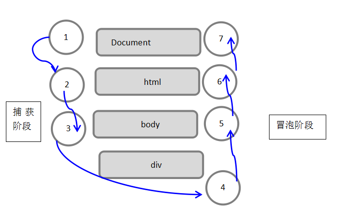

## 第八章：事件

JavaScript有三种事件模型：内联模型、脚本模型和DOM2模型。

```javascript
//在HTML中把事件处理函数作为属性执行JS代码
<input type="button" value="按钮" onclick="alert('Lee');"  />		//注意单双引号
  
//脚本模型。//对象.事件处理函数 = 函数名或者匿名函数
var input = document.getElementsByTagName('input')[0];		//得到input对象
//input.onclick = function () {//匿名函数执行
	//alert('Lee');
//};
//或者
input.onclick = box;		//赋值不能加括号
function box() {
		alert('Lee');
};
	
```

### 1.事件流

从页面接收事件的顺序

- IE的事件流是事件冒泡流
- Netscape 的事件流是事件捕获流

#### 1.1 事件冒泡

时间开始由最具体的元素接收，然后逐级向上传播到较为不具体的节点

*现代浏览器都支持事件冒泡*

#### 1.2 事件捕获

不具体的节点最早接收事件，最具体级节点最后接收

事件到达预定目标之前捕获它

老版浏览器不支持，所以少用

#### 1.3 DOM事件流

“DOM2级事件”规定事件流包括三个阶段：

- 事件捕获阶段
- 处于目标阶段
- 事件冒泡阶段

 

IE8及更早版本不支持事件流

### 2.事件处理程序

事件就是用户或者浏览器自身执行的某种动作。

响应某个事件的函数叫做*事件处理程序*（或事件侦听器）。名字以'on'开头

#### 2.1 HTML事件处理程序

```html
<input type="button" value="按钮" onclick="alert('Lee');" >
```

某个元素支持的每种事件，都可以使用一个与响应事件处理程序同名的HTML特性来指定。

事件处理程序可以包含要执行的具体动作，也可以调用在页面其他地方定义的脚本。

缺点：1.时差问题；2.跨浏览器问题

#### 2.2 DOM0级事件处理程序

```javascript
var btn=document.getElementById("mybtn");
btn.onclick = function () {
	alert('Lee');
};
```

将一个函数赋值给一个事件处理程序属性；
步骤：
1.取得要操作对象的引用
2.为它指定事件处理程序

好处：1.简单；2.跨浏览器

```javascript
btn.onclick=null;//删除事件处理程序
```

#### 2.3 DOM2级事件处理程序

DOM2级事件定义了两个方法，用于指定和删除事件处理程序操作

- *addEventListener()*
- *removeEventListener()*

所有的DOM节点都包含这两个方法

```javascript
element.addEventListener(event, function, useCapture)
```

| 参数         | 描述                                       |
| ---------- | ---------------------------------------- |
| event      | 必须。字符串，指定事件名。*注意:* 不要使用 "on" 前缀。 例如，使用 "click" ,而不是使用 "onclick"。 |
| function   | 必须。指定要事件触发时执行的函数。 当事件对象会作为第一个参数传入函数。 事件对象的类型取决于特定的事件。例如， "click" 事件属于 MouseEvent(鼠标事件) 对象。 |
| useCapture | 可选。布尔值，指定事件是否在捕获或冒泡阶段执行。可能值:true -事件句柄在捕获阶段执行;false- 默认。事件句柄在冒泡阶段执行 |

```javascript
var btn = document.getElementById("myBtn"); btn.addEventListener("click", function(){
    alert(this.id);
}, false);
btn.addEventListener("click", function(){
    alert("Hello world!");
}, false);
```

*好处：可以添加多个事件处理程序*， 按照添加顺序触发

注意：

- 通过addEventListener()添加的事件处理程序只能用removeEventListener()移除
- 所以addEventListener()添加的匿名函数无法移除，如上例中

修改后：

```javascript
var btn = document.getElementById("myBtn");
var handler = function(){
    alert(this.id);
};
//保证二者调用的是同一函数
btn.addEventListener("click", handler, false); 

var removeBtn = document.getElementById("myRemoveBtn");

removeBtn.onclick = function(){
btn.removeEventListener("click", handler, false);  
```

#### 2.4 IE事件处理程序

IE实现了与DOM中类似的两个方法

- *attachEvent()*
- *detachEvent()*

接收参数：事件处理程序名称、事件处理程序函数

```javascript
var btn = document.getElementById("myBtn"); btn.attachEvent("onclick", function(){
alert("Clicked"); 
});//注意是onclick不是click
```

区别：

- 此方法事件处理程序会在*全局作用域*运行；this等于window；DOM方法情况在所属元素作用域内运行
- 添加多个事件处理程序，以**相反的顺序**被触发

#### 2.5 跨浏览器的事件处理程序

*创建一个EventUtil对象及addHandler()和removeHandler()方法*

职责：视情况分别使用DOM2级方法、IE方法、DOM0级方法；

接收三个参数：要操作的元素、事件名称、事件处理程序函数；

使用方法：引入EventUtil.js文件；

```javascript
var btn = document.getElementById("myBtn");
var handler = function(){
     alert("Clicked");
 };
EventUtil.addHandler(btn, "click", handler); 
        
var removeBtn = document.getElementById("myRemoveBtn");

EventUtil.addHandler(removeBtn, "click", function(){
     EventUtil.removeHandler(btn, "click", handler); 
 });
// EventUtil.removeHandler(removeBtn, "click", handler); 而不是这样
```

### 3.事件对象

触发某个事件时，会产生一个事件对象event，包含所有与事件有关的信息，如时间元素、事件类型等

#### 3.1 DOM中的事件对象


#### 3.2 IE中的事件对象

#### 3.3 跨浏览器的事件对象


### 4.事件类型

JavaScript可以处理的事件类型为：鼠标事件、键盘事件、HTML事件。

所有的事件处理函数都会都有两个部分组成，*on + 事件名称*

JavaScript事件处理函数及其使用列表

| 事件处理函数      | 影响的元素             | 何时发生                  |
| ----------- | ----------------- | --------------------- |
| onabort     | 图像                | 当图像加载被中断时             |
| onblur      | 口、框架、所有表单对象       | 当焦点从对象上移开时            |
| onchange    | 输入框，选择框和文本区域      | 当改变一个元素的值且失去焦点时       |
| onclick     | 链接、按钮、表单对象、图像映射区域 | 当用户单击对象时              |
| ondblclick  | 链接、按钮、表单对象        | 当用户双击对象时              |
| ondragdrop  | 窗口                | 当用户将一个对象拖放到浏览器窗口时     |
| onError     | 脚本                | 当脚本中发生语法错误时           |
| onfocus     | 窗口、框架、所有表单对象      | 当单击鼠标或者将鼠标移动聚焦到窗口或框架时 |
| onkeydown   | 文档、图像、链接、表单       | 当按键被按下时               |
| onkeypress  | 文档、图像、链接、表单       | 当按键被按下然后松开时           |
| onkeyup     | 文档、图像、链接、表单       | 当按键被松开时               |
| onload      | 主题、框架集、图像         | 文档或图像加载后              |
| onunload    | 主体、框架集            | 文档或框架集卸载后             |
| onmouseout  | 链接                | 当图标移除链接时              |
| onmouseover | 链接                | 当鼠标移到链接时              |
| onmove      | 窗口                | 当浏览器窗口移动时             |
| onreset     | 表单复位按钮            | 单击表单的reset按钮          |
| onresize    | 窗口                | 当选择一个表单对象时            |
| onselect    | 表单元素              | 当选择一个表单对象时            |
| onsubmit    | 表单                | 当发送表格到服务器时            |

#### 4.1 UI事件

不一定与用户操作有关的事件

```javascript
 EventUtil.addHandler(window, "load", function(event){
      alert("Loaded!");
});
```

- DOMActivate：元素被用户操作激活，DOM3中被废弃
- load
- unload:页面完全卸载时，如刷新、清除引用
- abort：停止下载
- error
- select:当用户选择文本框(input或textarea)中的一个或多个字符触发。
- resize
- scroll

#### 4.2焦点事件

元素获得焦点或者失去焦点时触发，与document.hasFocus()方法及document.activeElement属性配合，可以知晓用户在页面上的行踪

当焦点有页面中一个元素移到另一个元素，6个事件按触发次序排列

- focusout:失去焦点
- focusin：获得焦点；冒泡
- blur:当页面或元素失去焦点时在window及相关元素上触发
- DOMFocusOut：DOM3中被废弃，选择focusout
- focus：不冒泡
- DOMFocusIn：DOM3中被废弃，选择focusin

#### 4.3鼠标与滚轮事件

##### 1.DOM3级规定9个鼠标事件

- click
- ​dblclick     :arrow_double_down:
- mousedown
- mouseup
- mousemove
- mouseout
- mouseover
- mouseenter:不冒泡
- mouseleave:不冒泡

mousedown/mouseup/click/dblclick四者触发顺序

IE8及之前版本的小bug：双击事件或跳过第二个mousedown和click事件


```javascript
//检测浏览器是否支持DOM2级事件
var isSupported=document.implementation.hasFeature("MouseEvents","2.0");
//检测浏览器是否支持上面所有鼠标事件级事件
var isSupported=document.implementation.hasFeature("MouseEvent","3.0");//注意MouseEvent不加s
```

还有一类滚轮事件mousewheel事件，跟踪鼠标滚轮

##### 1.客户区坐标位置

2.页面坐标位置

3.屏幕坐标位置

4.修改键

5.相关元素

6.鼠标按钮

7.更多事件信息

8.鼠标滚轮事件

9.触摸设备

#### 4.4键盘与文本事件

键盘事件

主要遵循DOM0级；DOM3级也有

- keydown：任意键触发
- keypress：字符键触发
- keyup：释放时触发

文本事件

- textInput：keypress的补充

##### 1.键码

##### 2.字符编码

##### 3.DOM3级变化

##### 4.textInput事件


### 5.内存和性能

### 6.模拟事件

### 7.小结