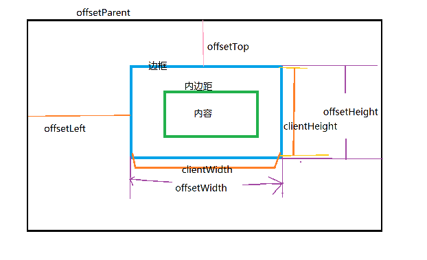

## 第八章：BOM

### 1.理解window对象

BOM的核心是window

window既是JavaScript访问浏览器窗口的一个接口，又是ECMAScript规定的Global对象

1.window对象是最顶层的对象

#### 1.1全局作用域

所有在全局作用域中声明的变量、函数都会变成window的属性和方法

```javascript
        var age = 29;
        window.color = "red";
        
        //throws an error in IE < 9, returns false in all other browsers
        delete window.age;

        //throws an error in IE < 9, returns true in all other browsers
        delete window.color;    //returns true
        
        alert(window.age);      //29
        alert(window.color);    //undefined
```

全局变量不能通过delete删除，直接在window对象上定义的可以

尝试访问未声明的变量会抛出错误，但是通过查询window对象，可能知道某个未声明的变量是否存在

#### 1.2窗口关系及框架

window.frames[0]、、、最好用top.frames[0]

top:指向最高层的框架

parent：当前框架的直接上层框架

self：始终指向window

#### 1.3窗口位置

IE、Safari、Opera和Chrome都提供了*screenLeft和screenTop属性*，分别用于表示窗口相对于屏幕左边和上边的位置。

Firefox则在*screenX和screenY属性*中提供相同的窗口位置信息，Safari和Chrome也同时支持这两个属性。

跨浏览器取得窗口左边和上边的位置,加上window防止报错

```javascript
var leftPos = (typeof window.screenLeft == "number") ? window.screenLeft : window.screenX;
var topPos = (typeof window.screenTop == "number")? 
 window.screenTop : window.screenY;

        alert("Left: " + leftPos);
        alert("Top: " + topPos);
```

将窗口精确移动到一个新位置

moveTo():新位置的x和y 坐标    //IE有效

moveBy()：水平和垂直方向移动的像素数   //IE有效

window.moveTo(0,0);

window.moveBy(0,100);向下移动100像素

#### 1.4 窗口大小

innerWidth,innerHeight/outerWidth,outerHeight

页面视图大小（减去边框宽度）/浏览器窗口本身尺寸加边框

PS：在Chrome中，innerWidth=outerWidthinnerHeight=outerHeight；

PS：IE没有提供当前浏览器窗口尺寸的属性；不过，在后面的DOM课程中有提供相关的方法。

在IE以及Firefox、Safari、Opera和Chrome中，document.documentElement.clientWidthdocument.documentElement.clientHeight中保存了页面窗口的信息。

PS：在IE6中，这些属性必须在标准模式下才有效；如果是怪异模式，就必须通过document.body.clientWidth和document.body.clientHeight取得相同的信息。

*document.documentElement.clientWidth*和*document.body.clientWidth*

标准模式/混杂模式

document.compatMode == "CSS1Compat"确定浏览器是否处于标准模式

**跨浏览器取得页面视口的大小**

```javascript
var pageWidth = window.innerWidth,//这里要加window，因为IE会无效
    pageHeight = window.innerHeight;
            
     if (typeof pageWidth != "number"){
         if (document.compatMode == "CSS1Compat"){
                pageWidth = document.documentElement.clientWidth;
                pageHeight = document.documentElement.clientHeight;
            } else {
                pageWidth = document.body.clientWidth;
                pageHeight = document.body.clientHeight;
            }
        }

        alert("Width: " + pageWidth);
        alert("Height: " + pageHeight);
```

调整浏览器窗口大小

resizeTo()   //IE有效

resizeBy()   //IE有效

#### 1.5 导航和打开窗口

window.open()方法导航到一个特定的URL，也可以打开一个新的浏览器窗口

四个参数（要加载的URL，窗口名称或者目标，一个特性字符串，一个表示新页面是否取代浏览器历史记录中当前加载页面的布尔值）

URL：

窗口目标：_self, _parent, _top, _blank或者框架的名字

第三个参数时一个逗号分隔的设置字符串

```javascript
var wroxWin = window.open("http://www.wrox.com/","wroxWindow",
"height:400,width:400,top:10,left:10,resizable==yes";);
```

wroxWin.close();关闭新打开的窗口

```javascript
//open本身返回window对象

var box = open();

box.alert('');                                                     //可以指定弹出的窗口执行alert();
```

```javascript
//子窗口操作父窗口

document.onclick = function () {

       opener.document.write('子窗口让我输出的！');

}
```


#### 1.6 简写调用和超时调用

超时调用：setTimeOut()

间歇调用：setInterval()

取消:clearTimeout

常见使用间歇调用案例；

```javascript
 var num = 0;
 var max = 10;
 var intervalId = null;
        
 function incrementNumber() {
            num++;
     if (num == max) {
         clearInterval(intervalId);
         alert("Done");
     }
 }
        
 intervalId = setInterval(incrementNumber, 500);
```

#### 1.7 系统对话框

alert()

confirm()：确认和取消

prompt():提示用户输入文本

window.print()

window.find()

defaultStatus = '状态栏默认文本';         //浏览器底部状态栏初始默认值

status='状态栏文本';                       //浏览器底部状态栏设置值

### 2.location对象

保存着当前文档的信息

使用location对象可以通过编程方式访问浏览器的导航系统。设置相应的属性，可以逐段或整体地修改兰兰器URL

既是window对象属性也是document对象属性

window.location和document.location引用的是同一个对象

 Location 对象属性

| 属性                                       | 描述                          |
| ---------------------------------------- | --------------------------- |
| [hash](http://www.w3school.com.cn/jsref/prop_loc_hash.asp) | 设置或返回从井号 (#) 开始的 URL（锚）。    |
| [host](http://www.w3school.com.cn/jsref/prop_loc_host.asp) | 设置或返回主机名和当前 URL 的端口号。       |
| [hostname](http://www.w3school.com.cn/jsref/prop_loc_hostname.asp) | 设置或返回当前 URL 的主机名。           |
| [href](http://www.w3school.com.cn/jsref/prop_loc_href.asp) | 设置或返回完整的 URL。               |
| [pathname](http://www.w3school.com.cn/jsref/prop_loc_pathname.asp) | 设置或返回当前 URL 的路径部分。          |
| [port](http://www.w3school.com.cn/jsref/prop_loc_port.asp) | 设置或返回当前 URL 的端口号。           |
| [protocol](http://www.w3school.com.cn/jsref/prop_loc_protocol.asp) | 设置或返回当前 URL 的协议。            |
| [search](http://www.w3school.com.cn/jsref/prop_loc_search.asp) | 设置或返回从问号 (?) 开始的 URL（查询部分）。 |

 Location 对象方法

| 属性                                       | 描述           |
| ---------------------------------------- | ------------ |
| [assign()](http://www.w3school.com.cn/jsref/met_loc_assign.asp) | 加载新的文档。      |
| [reload()](http://www.w3school.com.cn/jsref/met_loc_reload.asp) | 重新加载当前文档。    |
| [replace()](http://www.w3school.com.cn/jsref/met_loc_replace.asp) | 用新的文档替换当前文档。 |

assign()方法传递URL
location.assign('http://www.baidu.com');		//跳转到指定的URL

replace()可以装载一个新文档而无须为它创建一个新的历史记录，也就是说，在浏览器的历史列表中，新文档将替换当前文档。

location.reload();//重新加载，有可能从缓存中加载

location.reload(true);//重新加载，从服务器重新加载

### 3.navigator对象

识别客户端浏览器的事实标准

navigator对象属性

#### 3.1 检测插件

非IE浏览器使用plugins数组

- name:插件的名字
- description:插件的描述
- filename:插件的文件名
- length:插件所处理的MIME类型数量

```javascript
//plugin detection - doesn't work in IE
function hasPlugin(name){
    name = name.toLowerCase();
    for (var i=0; i < navigator.plugins.length; i++){
        (navigator.plugins[i].name.toLowerCase().indexOf(name) > -1){
            return true;
        }
    }
        
    return false;
}
         //detect flash 
alert(hasPlugin("Flash"));
         //detect quicktime
alert(hasPlugin("QuickTime"));
        
//detect Java
alert(hasPlugin("Java"));
```

toLowerCase()转成小写，indexOf方法对大小写敏感

indexOf()

indexOf() 方法可返回某个指定的字符串值在字符串中首次出现的位置。位置是从0开始的，如果要检索的字符串值没有出现，则该方法返回 -1。 

IE中的插件比较麻烦，要检测特定的插件就要知道COM标识符

因此要检测某个插件要分别创建检测函数，而不时用上面的通用方法

```javascript
//plugin detection - doesn't work in IE
function hasPlugin(name){
name = name.toLowerCase();
for (var i=0; i < navigator.plugins.length; i++){
    if (navigator.plugins[i].name.toLowerCase().indexOf(name) > -1){
        return true;
    }
}

return false;
}        

//plugin detection for IE
function hasIEPlugin(name){
try {
    new ActiveXObject(name);
    return true;
} catch (ex){
    return false;
}
}
//检测所有浏览器中的Flash
//detect flash for all browsers
function hasFlash(){
var result = hasPlugin("Flash");
if (!result){
    result = hasIEPlugin("ShockwaveFlash.ShockwaveFlash");
}
return result;
}
//检测所有浏览器quicktime
//detect quicktime for all browsers
function hasQuickTime(){
var result = hasPlugin("QuickTime");
if (!result){
    result = hasIEPlugin("QuickTime.QuickTime");
}
return result;
}

//detect flash
alert(hasFlash());

//detect quicktime
alert(hasQuickTime());
```

#### 3.2 注册处理程序

Firefox

### 4.screen对象

screen对象基本只用来表明客户端的能力，其中包括浏览器窗口外部的显示器信息，如像素宽和高

window.resizeTo(screen.availWidth和screen.availHeight）使其占用屏幕的可用空间

screen.width

### 5.history对象

用户上网历史记录

go()方法在用户历史记录中任意跳转

参数为数字：history.go(-1);后退一页

参数为字符串：history.go("wrox.com");跳转到最近的wrox.com页面

back()和forward()代替go()表示后退和前进

length属性保存着历史记录的数量

```
if(history.length==0){
//这应该是用户打开窗口后的第一个页面
}
```

## 第九章：客户端检测

不到万不得已不要使用客户端检测，而是找到更通用的方法，优先采用

方法很多

### 1.能力检测

最为人们广泛接受的客户端检测形式

又叫特性检测

能力检测的目标不是识别特定浏览器，而是识别浏览器的**能力**

如检测对象是否存在sort()方法

```
function isSortable(object){
return typeof object.sort == "function";
}
通过typeof方法，确定sort确实是函数，而不是包含sort属性的对象
```

### 2.怪癖检测

目标是识别浏览器的特殊行为；想知道浏览器存在什么缺陷（“怪癖”也就是bug)

### 3.用户代理检测

在服务器端常用的方法，在客户端万不得已才用

通过检测用户代理字符串来识别浏览器

电子欺骗的历史

检测技术：

- 识别呈现引擎

  五大呈现引擎：IE、Gecko、Webkit、KHTML、Opera

- 识别浏览器

- 识别平台

  三大主流平台：Windows、Mac、Unix（包括Linux）

- 识别Windows操作系统

- 识别移动设备

- 识别游戏系统

完整的代码，包括检测呈现引擎、平台、Windows操作系统、移动设备和游戏系统

[代码](file://E:\Web前端\练习\JavaScript\JavaScript高级程序设计（二）/client.js)

#### 使用方法

- 不能直接准确使用能力检测和怪癖检测
- 同一款浏览器在不同平台下具有不同能力，就必须确定浏览器位于哪个平台下
- 为了跟踪分析等目的需要知道确切的浏览器

## 第十章：DOM

DOM是针对HTML和XML文档的一个API（应用程序编程接口）。DOM描绘了一个层次化的节点树，允许开发人员添加、移除和修改页面的某一部分。

注意LIE中所有的DOM对象都是以COM对象的形式实现的。这意味着IE中的DOM对象与原生JavaScript对象的行为和活动特点并不一致

### 1.节点层次

12种节点类型

三类：

1.元素节点1
2.属性标签2
3.文本节点3


#### 1.1Node类型

每个节点都有一个nodeType属性

nodeType 属性返回以数字值返回指定节点的节点类型。

如果节点是元素节点，则 nodeType 属性将返回 1。

如果节点是属性节点，则 nodeType 属性将返回 2。

```javascript
//IE不支持，我们可以模拟一个类，让IE也支持node。
if (typeof Node == 'undefined') {				//IE返回
	window.Node = {
		ELEMENT_NODE : 1,
		TEXT_NODE : 3
	};
}
```

| 类型   | 描述                    | 子节点                            |                                          |
| ---- | --------------------- | :----------------------------- | :--------------------------------------- |
| 1    | Element               | 代表元素                           | Element, Text, Comment, ProcessingInstruction, CDATASection, EntityReference |
| 2    | Attr                  | 代表属性                           | Text, EntityReference                    |
| 3    | Text                  | 代表元素或属性中的文本内容。                 | None                                     |
| 4    | CDATASection          | 代表文档中的 CDATA 部分（不会由解析器解析的文本）。  | None                                     |
| 5    | EntityReference       | 代表实体引用。                        | Element, ProcessingInstruction, Comment, Text, CDATASection, EntityReference |
| 6    | Entity                | 代表实体。                          | Element, ProcessingInstruction, Comment, Text, CDATASection, EntityReference |
| 7    | ProcessingInstruction | 代表处理指令。                        | None                                     |
| 8    | Comment               | 代表注释。                          | None                                     |
| 9    | Document              | 代表整个文档（DOM 树的根节点）。             | Element, ProcessingInstruction, Comment, DocumentType |
| 10   | DocumentType          | 向为文档定义的实体提供接口                  | None                                     |
| 11   | DocumentFragment      | 代表轻量级的 Document 对象，能够容纳文档的某个部分 | Element, ProcessingInstruction, Comment, Text, CDATASection, EntityReference |
| 12   | Notation              | 代表 DTD 中声明的符号。                 | None                                     |

##### 1.nodeName 和 nodeValue属性

了解节点的具体信息

nodeValue必须在当前节点！与innerHTML区分

- 在获取到*文本节点*的时候，是无法使用innerHTML这个属性输出文本内容的。这个非标准的属性必须在获取*元素节点*的时候，才能输出里面包含的文本。
- nodeValue会把包含在文本里的HTML转义成特殊字符，从而达到形成单纯文本的效果。<strong>abc</strong>

```javascript
if(someNode.nodeType==1){

value=someNode.nodeName;//nodeName的值是元素的标签名

}
nodeValue的值为null
```

##### 2.节点关系

每个节点都有一个childNodes属性，其中保存一个NodeList对象;

NodeList是一种类数组对象，用来保存一组有序的节点。但他不是Array的实例！！！是动态的

```
var firstChild=someNode.childNode[0];
```

层次节点属性

| 属性              | 说明                      |
| --------------- | ----------------------- |
| childNodes      | 获取当前元素节点的所有子节点          |
| firstChild      | 获取当前元素节点的第一个子节点         |
| lastChild       | 获取当前元素节点的最后一个子节点        |
| ownerDocument   | 获取该节点的文档根节点，相当与document |
| parentNode      | 获取当前节点的父节点              |
| previousSibling | 获取当前节点的前一个同级节点          |
| nextSibling     | 获取当前节点的后一个同级节点          |
| attributes      | 获取当前元素节点的所有属性节点集合       |

将arguments对象使用Array.prototype.slice()方法可以转换成数组

```javascript
function convertToArray(nodes){
var array =null;
try{
array Array.prptptype.slice.call(node,0);//针对非IE浏览器
catch(ex){
array = new Array();
for(var i=0,len=nodes.length;i<len;i++){
array.push(nodes[i]);
}
}
return array;
}
```

hasChildNode():是否有一个或多个子节点

ownerDocument指向整个文档的文档节点，返回的对象相当于document

##### 3.操作节点

| 方法               | 说明                 |
| ---------------- | ------------------ |
| write()          | 这个方法可以把任意字符串插入到文档中 |
| createElement()  | 创建一个元素节点           |
| appendChild()    | 将新节点追加到子节点列表的末尾    |
| createTextNode() | 创建一个文件节点           |
| insertBefore()   | 将新节点插入在前面          |
| repalceChild()   | 将新节点替换旧节点          |
| cloneNode()      | 复制节点               |
| removeChild()    | 移除节点               |

appendChild():向childNodes列表末尾添加一个节点

innerBefore():要插入的节点，作为参照的节点

replaceChild()：要插入的节点，要替换的节点

removeChild():要移除的节点

cloneNode():true标签和文本，false只有标签0

通过父节点操作

##### 4.其他方法

cloneNode()

- true：深度复制节点及其真个子节点树
- false：只复制节点本身

#### 1.2Document类型

特征：

- nodeType值为9
- nodeName为"#document"
- nodeValue的值为null
- parentNode为null
- ownerDocument为null
- 子节点可以是DocumentType、Element、ProcessingInstruction或Comment

##### 1.文档的子节点

document.documentElement   //HTMLHtmlElement
document.body                          指向<body>

以上两种属性所有浏览器都支持

document.doctype//取得对<!DOCTYPE>的引用

不同浏览器的差别很大，所以用处有限

##### 2.文档信息

//属性

document.title;				//获取和设置<title>标签的值

document.URL;				//获取URL路径

document.domain;			//获取域名，服务器端

document.referrer;			//获取上一个URL，服务器端

##### 3.查找元素

①getElementById()

- 不要让表单字段的name特性与其他元素的ID相同

②getElementsByTagName()

- 返回的是包含零个或多元素的动态集合HTMLCollection
- 可以用[]或者item()放法访问
- HTMLCollection还有一个namedItem()方法，通过元素的name特性取得集合中的项。也可以使用方括号

```javascript
var images=document.getElementsByTagName("img")

var myImage=images.namedItem("myImage");
var myImage=images["myImage"];
```

- getElementsByTagName(*)取得文档中所有元素，第一项<html>第二项<head>，IE把！当第一个，多一个

③getElementByName()：常用来选单选按钮

##### 4.特殊集合

为访问文档的常用部分提供了*快捷方式*

- document.anchors：带name特性的<a>元素

- document.forms

- document.images

- document.links：所有带href特性的<a>元素

  之前的快捷方式

- document.body 

- document.documentElement

- document.doctype

##### 5.DOM一致性检测

检测浏览器实现了DOM的哪些部分

DOM1级实现了最基本的文档处理，DOM2和DOM3在这个基础上增加了更多的交互能力，这里我们主要探讨CSS，DOM2增加了CSS编程访问方式和改变CSS样式信息。

DOM一致性检测

| 功能             | 版本号         | 说明                        |
| -------------- | ----------- | ------------------------- |
| Core           | 1.0、2.0、3.0 | 基本的DOM,用于表现文档节点树          |
| XML            | 1.0、2.0、3.0 | Core的XML扩展，添加了对CDATA等支持   |
| HTML           | 1.0、2.0     | XML的HTML扩展，添加了对HTML特有元素支持 |
| Views          | 2.0         | 基于某些样式完成文档的格式化            |
| StyleSheets    | 2.0         | 将样式表关联到文档                 |
| CSS            | 2.0         | 对层叠样式表1级的支持               |
| CSS2           | 2.0         | 对层叠样式表2级的支持               |
| Events         | 2.0         | 常规的DOM事件                  |
| UIEvents       | 2.0         | 用户界面事件                    |
| MouseEvents    | 2.0         | 由鼠标引发的事件(如：click)         |
| MutationEvents | 2.0         | DOM树变化时引发的事件              |
| HTMLEvents     | 2.0         | HTML4.01事件                |
| Range          | 2.0         | 用于操作DOM树中某个范围的对象和方法       |
| Traversal      | 2.0         | 遍历DOM树的方法                 |
| LS             | 3.0         | 文件与DOM树之间的同步加载和保存         |
| LS-Async       | 3.0         | 文件与DOM树之间的异步加载和保存         |
| Valuidation    | 3.0         | 在确保有效的前提下修改DOM树的方法        |

 

```javascript
//检测浏览器是否支持DOM1级CSS能力或DOM2级CSS能力

alert('DOM1级CSS能力：' + document.implementation.hasFeature('CSS', '2.0'));

alert('DOM2级CSS能力：' + document.implementation.hasFeature('CSS2', '2.0'))
//PS：这种检测方案在IE浏览器上不精确，IE6中，hasFeature()方法只为HTML和版本1.0返回true，其他所有功能均返回false。但IE浏览器还是支持最常用的CSS2模块。
```

DOM1级为document.implementstion属性规定了一个方法hasFeature()：接受两个参数（要检测的DOM功能的名称及版本号）

##### 6.文档写入

将输出流写入到网页的能力

四个方法：

- write()：原样写入
- writeln()：末尾添加换行符\n
- open()
- close()

```javascript
<script type="text/javascript">
    document.write("<script type=\"text\javascript\" src=\"file.js\">" +   
        "<\/script>");//注意加入转义字符\
</script>
```

#### 1.3 Element类型

Element类型勇于表现XML和HTML元素

- nodeType的值为1；
- nodeName的值为元素的标签名，tagName属性也是；
- parentNode可能是Document或者Element；
- nodeValue为null.而不是里面的内容

在HTML中，标签名始终全部大写，XML中与源码相同

```
if(element.tagName.toLowerCase()=="div"){
//这样转换大小写比较最好，不容易出错
}
```

##### 1.HTML元素

标准特性

- id
- title：元素的附加说明信息
- lang
- dir
- className

##### 2. *取得特性*

操作特性的DOM方法有三个

- getAttribute()
- setAttribute()
- removeAttribute()

也可以取得自定义特性

特殊：

- style
- onclick这样的事件处理程序
- className用getAttribute()不兼容，直接box.className兼容

他们虽然有对应的属性名，但是属性的值与通过getAttribute()返回的值并不同。

所以经常不使用getAttribute()，而是只使用对象的属性

##### 3.设置特性

setAttribute()：两个参数（要设置的特性名，值）

如果特性已存在则替换，如果无则创建

```
div.id="someOtherId"
dic.align="left"
```

直接给属性赋值

IE7及以下不支持style和onclick没有效果，避免使用

##### 4.attribute属性

Element类型是使用attribute属性唯一的DOM节点类型

attribute属性中包含一个NameNodeMap，动态的集合

NameNodeMap对象拥有下列方法

| 方法                 | 描述                         |
| ------------------ | -------------------------- |
| getNamedItem(name) | 可返回指定的节点（通过名称）             |
| setNamedItem(name) | 像列表中添加节点，以节点的nodeName属性为索引 |
| item(pos)          | 可返回处于数字pos位置的节点            |
| removeNamedItem()  | 可删除指定的节点（根据名称）             |

```javascript
var pairs = new Array(),
    attrName,
    attrValue,
    i,
    len;

for (i=0, len=element.attributes.length; i < len; i++){
    attrName = element.attributes[i].nodeName;
    attrValue = element.attributes[i].nodeValue;
    if (element.attributes[i].specified){
        pairs.push(attrName + "=\"" + attrValue + "\"");
    }
}
return pairs.join(" ");
}
//遍历元素特性，构造字符串
```

##### 5.创建元素

document.creatElement()方法

浏览器要呈现要先添加到文档树上

##### 6.元素的子节点

childNodes

浏览器对待节点的不同

```html
    <ul id="myList">
        <ll>item 1</ll>
        <ll>item 2</ll>
        <ll>item 3</ll>
    </ul>
```

IE浏览器:3个子节点

其他浏览器：7个子节点，包括了四个文本节点

保持一致：

```javascript
function filterSpaceNode(nodes) {
		for (var i = 0; i < nodes.length; i ++) {
			if (nodes[i].nodeType == 3 && /^\s+$/.test(nodes[i].nodeValue)) {	nodes[i].parentNode.removeChild(nodes[i]);// 得到空白节点之后，移到父节点上，删除子节点
			}
		}
		return nodes;
	}
```

*处理方法：在执行某项操作以前，检查nodeType属性==1（元素节点）*

```javascript
for (var i = 0; len = element.childNodes.length; i<len,i++) {
    if(element.childNodes[i].nodeType==1;){
        //执行某项操作
    }
}
```

#### 1.4 Text类型

包含可以照字面解释的纯文本内容，纯文本内容可以包括转义后的HTML字符，但不能包含HTML代码

- nodeType值为3
- nodeName值为"#text"，没有标签名
- 没有子节点

可以通过nodeValue属性或者data属性访问Text节点中包含的文本。*×××*而不是innerHTML！！！因为这是找里面的！

操作节点的文本

- appendData(text)
- deleteData()
- insertData()
- replaceData()
- splitText()
- substringData()

除了上面的两种方法外，Text还提供了一些别的DOM操作的方法如下：

```javascript
var box = document.getElementById('box');

box.firstChild.deleteData(0,2);	//删除从0位置的2个字符

box.firstChild.insertData(0,'Hello.');//从0位置添加指定字符

box.firstChild.replaceData(0,2,'Miss');//从0位置替换掉2个指定字符

box.firstChild.substringData(0,2);	//从0位置获取2个字符，直接输出

alert(box.firstChild.nodeValue);	//输出结果
```

##### 1.创建文本节点

document.createTextNode()

##### 2.规范化文本节点

在父元素上调用normalize()方法将相邻文本节点合并

##### 3.分割文本节点

*splitText()*

splitText(5)从位置5开始分割成原来的文本节点和新的文本节点，还在原来的父节点下；剩下的是新的

#### 1.5Comment类型

- nodeType值为8
- nodeName值为"#comment"
- 没有子节点

与Text类型继承自相同的基类，拥有除了splitText()之外的所有字符串操作方法

注释节点也是一个子节点

#### 1.6 CDATASection类型

针对基于XML的文档

#### 1.7DocumentType类型

- nodeType值为10

#### 1.8DOcumentFragment类型

轻量级文档，可以包含和控制节点

不会占用资源

可以当“仓库”来使用

#### 1.9Attr类型

元素的特性

尽管他们也是节点，但特性不被认为是DOM文档树的一部分

Attr对象三个属性：name，value，specified

### 2.DOM操作技术

#### 2.1 动态脚本

- 插入外部文件
- 直接插入JavaScript代码

#### 2.2动态样式

- link外部文件——插入head元素
- style嵌入

以上两种直接插入代码的方法，要注意兼容性，因为IE将<script>和<style>视为特殊的元素，不允许访问其子节点；所以可以用text属性

script.text=“”

而Safari3之前的版本不能正确支持text属性

#### 2.3操作表格

##### Table 对象集合

| 集合      | 描述                     |
| ------- | ---------------------- |
| cells   | 返回包含表格中所有单元格的一个数组。     |
| rows    | 返回包含表格中所有行的一个数组。       |
| tBodies | 返回包含表格中所有 tbody 的一个数组。 |

PS：使用DOM来创建表格其实已经没有什么难度，就是有点儿小烦而已。下面我们再使用HTML DOM来获取和创建这个相同的表格。

HTML DOM中，给这些元素标签提供了一些*属性和方法*

**注：大小写区分**

| 属性或方法           | 说明                            |
| --------------- | ----------------------------- |
| caption         | 保存着<caption>元素的引用             |
| tBodies         | 保存着<tbody>元素的HTMLCollection集合 |
| tFoot           | 保存着对<tfoot>元素的引用              |
| tHead           | 保存着对<thead>元素的引用              |
| rows            | 保存着对<tr> 元素的HTMLCollection集合  |
| createTHead()   | 创建<thead>元素，并返回引用             |
| createTFoot()   | 创建<tfoot>元素，并返回引用             |
| createCaption() | 创建<caption>元素，并返回引用           |
| deleteTHead()   | 删除<thead>元素                   |
| deleteTFoot()   | 删除<tfoot>元素                   |
| deleteCaption() | 删除<caption>元素                 |
| deleteRow(pos)  | 删除指定的行                        |
| insertRow(pos)  | 向rows集合中的指定位置插入一行             |

<tbody>元素添加的属性和方法

| 属性或方法          | 说明                            |
| -------------- | ----------------------------- |
| rows           | 保存着<tbody>元素中行的HTMLCollection |
| deleteRow(pos) | 删除指定位置的行                      |
| insertRow(pos) | 向rows集合中的指定位置插入一行，并返回引用       |

<tr>元素添加的属性和方法

| 属性或方法           | 说明                           |
| --------------- | ---------------------------- |
| cells           | 保存着<tr>元素中单元格的HTMLCollection |
| deleteCell(pos) | 删除指定位置的单元格                   |
| insertCell(pos) | 向cells集合的指定位置插入一个单元格，并返回引用   |

PS：因为表格较为繁杂，层次也多，在使用之前所学习的DOM只是来获取某个元素会非常难受，所以使用HTML DOM会清晰很多

```javascript
alert(table.tBodies[0].rows[1].cells[1].innerHTML);		//很清晰，很方便
table.tBodies[0].deleteRow(0);
```

#### 2.4使用NodeList

NodeList

NamedNodeMap

HTMLCollection

这三个集合都是动态的

想要迭代一个NodeList，最好使用length属性初始化第二个变量，然后将迭代器与变量进行比较

```javascript
for (var i = 0; len = divs.length; i<len,i++)
```

## 第十一章：DOM扩展

### 1.选择符API

根据CSS选择符选择与某个模式匹配的DOM元素

#### 1.1 querySelector()方法

接收一个css选择符，返回模式匹配的**第一个元素**

document类型调用，会在文档元素范围查找

Element类型调用，会在在元素后代查找

#### 1.2querySelector()

返回**所有**匹配元素，返回的是一个NodeList实例

要取得返回的NodeList的每个元素，可以用[]，或者item()

#### 1.3matchesSelector()

接收一个CSS选择符，如果调用元素与该选择符匹配，返回true

由于浏览器对于这一功能的支持不同，需要使用包装函数

### 2.元素遍历

支持Element Traversal 规范的浏览器有IE 9+、Firefox 3.5+、Safari 4+、Chrome 和Opera 10+。

对于元素间的空格，在IE9之前，都不会返回文档节点，其它的所有浏览器都会返回文档节点。

为了兼容浏览器这间的差异，又不更改已有的DOM 标准，所以有了 Element Traversal 规范。

这个规范为 元素增加了 5 个 属性

- childElementCount
- firstElementChild
- lastElementChild
- previousElementSibling
- nextElementSibling

```javascript
     child=element.firstElementChild;
while(child!=element.lastElementChild){
     processChild(child);
     child = child.nextElementSibling;
     }
```

### 3.HTML5

#### 3.1与类相关的扩充

##### 1.getElementsByClassName()方法

可以包含一个或者多个类名

返回的对象是NodeList

##### 2.classList属性

 classList 属性返回元素的类名，作为DOMTokenList 对象。
该属性用于在元素中添加，移除及切换 CSS 类。 
 classList 属性是只读的，但你可以使用add() 和 remove() 方法修改它

- add(class1, class2, ...)

- contains(class)：存在返回true

- remove(class1, class2, ...)

- toggle(class)：如果有就删除，没救就添加

-支持classList 属性的浏览器有Firefox3.6和Chrome

#### 3.2 焦点管理

document.activeElement属性：引用给当前获得焦点的元素

document.hasFocus()方法：确定文档是否获得了焦点

#### 3.3 HTMLDocument的变化

HTML5扩展了HTMLDocument

##### 1.readyState属性

- loading
- complete

```
if(document.readyState == "complete"){
//执行操作
};
```

##### 2.兼容模式

document.compatMode的值

- CSS1Compat——标准模式
- BackCompat——混杂模式

从IE6开始开始区分标准模式和混杂模式(怪异模式)，主要是看文档的声明。IE为document对象添加了一个名为compatMode属性，这个属性可以识别IE浏览器的文档处于什么模式如果是标准模式，则返回CSS1Compat，如果是混杂模式则返回BackCompat。

```javascript

	if (document.compatMode == 'CSS1Compat') {
		alert(document.documentElement.clientWidth);
	} else {
		alert(document.body.clientWidth);
	}
```

#### 3.4字符集属性

- document.charset
- document.defaultcharset

#### 3.5自定义数据属性

HTML5 规定可以为元素添加非标准的属性，但要添加前缀data-，目的是为元素提供与渲染无关的信息，或者提供语义信息。

可以通过dataset属性访问自定义属性的值

dataset属性的值是DOMStringMap的一个实例，也就是一对名值对的映射

#### 3.6插入标记

使用插入标记技术，直接插入HTML字符串更简单

1.*innerHTML属性*
2.outerHTML

返回调用它的元素及所有子节点的HTML标签

innerHTML 设置或获取位于对象起始和结束标签内的 **HTML** 
outerHTML 设置或获取对象及其内容的 HTML 形式 
innerText 设置或获取位于对象起始和结束标签内的**文本** 
outerText 设置(包括标签)或获取(不包括标签)对象的文本 

##### 3.insertAdjacentHTML()方法

两个参数（插入的位置，HTML文本）

第一个参数的值：

- beforebegin:之前同辈

- afterbegin：第一个子元素

- beforeend：最后一个子元素

- afterend：之后同辈

  ​

##### 4.内存与性能问题

单独构建字符串，再把结果字符串赋值给innerHTML

#### 3.7 scrollIntoView()方法

可以在所有HTML元素调用，通过滚动浏览器窗口或某个容器元素，焦勇元素就可以出现在视口中。

- true：调用元素的顶部与视口顶部齐平
- false：调用元素尽可能全部出现在视口

```
//让元素可见
document.forms[0].scrollInterView()
```

### 4.专有扩展

#### 4.1文档模式

#### 4.2children属性

由于子节点空白问题，IE和其他浏览器解释不一致。虽然可以过滤掉，但如果只是想得到有效子节点，可以使用children属性，支持的浏览器为：IE5+、Firefox3.5+、Safari2+、Opera8+和Chrome，这个属性是非标准的。

```javascript
var box = document.getElementById('box');
alert(box.children.length);		//得到有效子节点数目
alert(box.childNodes.length);
```

#### 4.3contains()方法

某个节点是不是另一个节点的后代

```javascript
alert(box.contains(box.firstChild));		//true
```

PS：早期的Firefox不支持这个方法，新版的支持了，其他浏览器也都支持，Safari2.x浏览器支持的有问题，无法使用。所以，必须做兼容。

为了能让所有浏览器都可以兼容，我们必须写一个兼容性的函数。

```javascript
//传递参考节点(父节点)，和其他节点(子节点)
function contains(refNode, otherNode) {
//判断支持contains，并且非Safari浏览器
	if (typeof refNode.contains != 'undefined' && 
!(BrowserDetect.browser == 'Safari' && BrowserDetect.version < 3)) {
		return refNode.contains(otherNode); 
//判断支持compareDocumentPosition的浏览器，大于16就是包含
	} else if (typeof refNode.compareDocumentPosition == 'function') {
		return !!(refNode.compareDocumentPosition(otherNode) > 16);
	} else {
//更低的浏览器兼容，通过递归一个个获取他的父节点是否存在
		var node = otherNode.parentNode;
		do {
			if (node === refNode) {
				return true;
			} else {
				node = node.parentNode;
			}
			} while (node != null);
		}
		return false;
}
```

#### 4.4插入文本

innerText属性
outerText属性

PS：除了Firefox之外，其他浏览器均支持这个方法。但Firefox的DOM3级提供了另外一个类似的属性：textContent，做上兼容即可通用。

```javascript
document.getElementById('box').innerText;		//获取文本内容(如有html直接过滤掉)
document.getElementById('box').innerText = 'Mr.Lee';
//设置文本(如有html转义)

//兼容方案
function getInnerText(element) {
	return (typeof element.textContent == 'string') ? 
element.textContent : element.innerText;
}

function setInnerText(element, text) {
	if (typeof element.textContent == 'string') {
		element.textContent = text;
	} else {
		element.innerText = text;
	}
}
```

#### 4.5滚动

所有浏览器都支持，最常用：document.getElementById('box').*scrollIntoView()*;	//设置指定可见

其他方法：

- scrollIntoViewIfNeeded()：如果不可见则让它可见
- scrollByLines():滚动指定的行高
- scrollByPages()：滚动指定的页面高度

## 第十二章：DOM2和DOM3

DOM1级主要定义的是HTML和XML文档的底层结构。DOM2与DOM3主要是在DOM1的基础上引入更多的交互能力，支持了更高级的XML特性。

DOM2 和DOM3级分为许多模块（模块之间具有某种关联），分别描述了DOM 的某个非常具体的子集。这些模块如下

- DOM2 级核心（DOM Level 2 Core）：在1 级核心基础上构建，为节点添加了更多方法和属性。
- DOM2 级视图（DOM Level 2 Views）：为文档定义了基于样式信息的不同视图。
- DOM2 级事件（DOM Level 2 Events）：说明了如何使用事件与DOM文档交互。
- DOM2 级样式（DOM Level 2 Style）：定义了如何以编程方式来访问和改变CSS 样式信息。
- DOM2 级遍历和范围（DOM Level 2 Traversal and Range）：引入了遍历DOM 文档和选择其特定部分的新接口。
- DOM2 级 HTML（DOM Level 2 HTML）：在1 级HTML 基础上构建，添加了更多属性、方法和新接口

### 1.DOM变化

DOM2和DOM3，实现了对既有的API进行扩展，提供了更好的错误处理以及特性检测能力。这从很大程度上支持了命名空间。要确定浏览器是否支持DOM2和DOM3，可以使用以下的代码：

```javascript
var supportsDOM2Core=document.implementation.hasFeature("Core","2.0");

var supportsDOM3Core=document.implementation.hasFeature("Core","3.0");

var supportsDom2HTML=document.implementation.hasFeature("HTML","2.0");

var supportsDOM2Views=document.implementation.hasFeature("Views","2.0");

var supportsDom2XML=document.implementation.hasFeature("XML","2.0");

```


#### 1.1针对XML命名空间的变化

有了XML的命名空间，不同XML可以合并成为一个XML。从技术上说，html不支持XML命名空间，但是XHTML支持。命名空间要使用xmlns特性来指定。

使用示例：

<html  xmlns="http://www.w3.org/1999/xhtml">, 使用它来替换<html>

但是，想要明确的为XML命名空间创建前缀，可以使用xmlns后跟冒号，再后跟前缀。

<xhtml:html xmlns:xhtml= "http://www.w3.org/1999/xhtm" > ,使用它来替换<html>

为了区分XHTML中元素，避免混乱，也需要使用命名空间来进行限定标签名称和标签属性。

DOM2提供的针对命名空间的解决方法

##### 1.Node类型的变化

在DOM2级别中，Node类型包含特定于命名空间的属性

- localname:不带命名空间前缀的节点名称


- namespaceURI：命名空间的URI或者（未指定的情况下）null


- prefix：命名空间前缀或者（未指定的情况下）null

DOM3在此基础上更进一步，引入例如与命名空间相关的方法：

- isDefaultNamespace(namespaceURI):在指定的namespaceURI是当前节点的默认命名空间的情况下返回true

- lookupNamespaceURI(prefix):返回给定的prefix的命名空间

- lookupPrefix(namespaceURI):返回给定的namespaceURI的前缀

##### 2.Document类型的变化

DOM2为命名空间创建了一下的方法：方法的意义类似DOM1的

- createElementNS(namespaceURI,tagName):
- createAttributeNS(namespaceURI,attributeName):
- getElementsByTagNameNS(namespaceURI,tagName):

##### 3.Element类型的变化

DOM2级核心中有关Element的变化主要涉及操作特性。新增方法具体意义参见DOM1的：
- getAttributeNS(namespaceURI,localname):
- getAttributeNodeNS(namespaceURI,localname):
- getElementsByTagNameNS(namespaceURI,tagName):
- hasAttributeNS(namespaceURI,attributeName):
- removeAttributeNS(namespaceURI,attributeName):
- setAttributeNS(namespaceURI,qualifiedName,value):
- setAttributeNodeNS(attNode):

##### 4.NamedNodeMap类型的变化,同上

- getNamedItemNS(namespaceURI,localName):
- removeNamedItemNS(namespaceURI,localName):
- setNamedItemNS(node):

#### 1.2 其他方面的变化

这些变化与XML命名空间无关，而是更倾向于确保API的可靠性和完整性。

##### 1.DocumentType类型的变化

新增了三个属性:
- publicId:
- systemId:
- interbalSubset:

以下面的标签为例：

```
<！DOCTYPE HTML PUBLIC "-//W3C//DTD HTML 4.01 //EN" "http://www.w3.org/TR/html4/strict.dtd">
```

publicId=-//W3C//DTD HTML 4.01 //EN

systemId=“http://www.w3.org/TR/html4/strict.dtd](http://www.w3.org/TR/html4/strict.dtd) ”

  最后一个属性interSubset不常用，访问内部子集用的，XML用的较多。

##### 2.Document类型的变化

唯一与命名空间无关的方法是importNode()，这个是用来<u>从一个文档中取得一个节点，然后导入另一个文档的，使其成为另一个文档结构的一部分。</u>它接收两个参数：要复制的节点和一个鄙视是否复制子节点的布尔值。

##### 3.Node类型的变化

##### 4.框架的变化

### 2.样式

在 HTML 中定义样式的方式有3 种：

- 通过<link/>元素包含外部样式表文件、

- 使用<style>元素定义嵌入式样式

- 使用style 特性定义针对特定元素的样式。

“DOM2 级样式”模块围绕这3 种应用样式的机制提供了一套API。要确定浏览器是否支持DOM2 级定义的CSS 能力，可以使用下列代码         

```javascript
var supportsDOM2CSS = document.implementation.hasFeature("CSS", "2.0");
var supportsDOM2CSS2 = document.implementation.hasFeature("CSS2", "2.0");
```

#### 2.1访问元素的样式

style属性只能获取和设置*行内*，不能获取内联和链接（可以用计算后的样式）

- style.color普通

- style.backgroundImage短划线的变驼峰

- style.Float（IE）和CSSFloat的不同浏览器

```javascript
alert(box.style.cssFloat || box.style.styleFloat);
//跨浏览器兼容
```

##### 1.DOM样式属性和方法

- cssText：通过它能够访问和设置style 特性中的CSS代码.支持IE6+,chrome,firfox.
- length：应用给元素的CSS 属性的数量。支持IE9+,chrome,firfox.
- parentRule：表示CSS 信息的CSSRule 对象,后面将讨论CSSRule 类型。
- getPropertyPriority(propertyName)：如果给定的属性使用了!important 设置，则返回"important"；否则，返回空字符串。支持IE9+,chrome,firfox.
- getPropertyValue(propertyName)：返回给定属性的字符串值。支持IE9+、Safari,Chrome,firfox
- item(index)：返回给定位置的CSS 属性的名称。支持IE9+、Safari,Chrome,firfox
- removeProperty(propertyName)：从样式中删除给定属性。支持IE9+、Safari,Chrome,firfox
- setProperty(propertyName,value,priority)：将给定属性设置为相应的值，并加上优先权标志（"important"或者一个空字符串）。支持IE9+、Safari,Chrome,firfox

```javascript
//设置style对象的cssText属性
myDiv.style.cssText = "width: 25px; height: 100px; background-color: green";
alert(myDiv.style.cssText);
```

##### 2.计算的样式

**计算样式的获取，不仅仅可以获取没有设置的默认样式，也可以获取行内、内联和链接**

虽然可以通过style来获取单一值的CSS样式，但对于复合值的样式信息，就需要通过*计算样式*来获取。DOM2级样式，window对象下提供了*getComputedStyle()方法*。接受两个参数，①需要计算的样式元素，②第二个伪类(:hover)，如果没有没有伪类，就填null。

IE方法currentStyle

```javascript

var style = window.getComputedStyle(box, null);
	alert(style.color);		//计算后的样式，一般表示默认样式和设置后的样式
var style = box.currentStyle;
	alert(style.color);		//IE的计算样式
	alert(style.fontSize);
//兼容方法
var style = window.getComputedStyle ? window.getComputedStyle(box, null) : null || box.currentStyle;
```
PS：border属性是一个*综合属性*，所以他在Chrome显示了，Firefox为空，IE为undefined。所谓综合性属性，就是XHTML课程里所的简写形式，所以，DOM在获取CSS的时候，最好采用完整写法兼容性最好，比如：border-top-color之类的。

#### 2.2操作样式表

1.在*添加className*的时候，我们想给一个元素添加多个class是没有办法的，后面一个必将覆盖掉前面一个，所以必须来写个函数：

box.className = 'bbb';这样设置前面的class就都没有啦清除了再添加了
函数方法添加

```javascript
//检查class是否存在
function hasClass(element, cName) {
	return !!element.className.match(new RegExp('(\\s|^)' + cName + '(\\s|$)'));
}


//添加一个class
function addClass(element, cName) {
	if (!hasClass(element, cName)) {
		element.className += ' ' + cName;
	}
}

//移除一个class
function removeClass(element, cName) {
	if (hasClass(element, cName)) {
		element.className = element.className.replace(new RegExp('(\\s|^)' + cName + '(\\s|$)'), ' ');
	}
}
```

2.前面的方法：行内样式可以获取可以赋值；计算后的样式只能获取不能赋值；

*CSSStyleSheet 类型表示的是样式表*，包括通过<link>元素包含的样式表和在<style>元素中定义的样式表,使用下面的代码可以确定浏览器是否支持DOM2 级样式表：         

```javascript
var supportsDOM2StyleSheets =document.implementation.hasFeature("StyleSheets", "2.0");
```

```javascript
document.getElementsByTagName('link')[0];	//HTMLLinkElement
document.getElementsByTagName('style')[0];	//HTMLStyleElement

//这两个元素本身返回的是HTMLLinkElement和HTMLStyleElement类型，但CSSStyleSheet类型更加通用一些。得到这个类型非IE使用sheet属性，IE使用styleSheet；
var link = document.getElementsByTagName('link')[0];
var sheet = link.sheet || link.styleSheet;			//得到CSSStyleSheet
```
更加简便的获取sheet的方法
*document.styleSheets*得到的是StyleSheetList集合

```javascript
var sheet = document.styleSheets[0];		//这个属性，所有浏览器都兼容的
```

3.
CSSStyleSheet 继承自StyleSheet，后者可以作为一个基础接口来定义非CSS 样式表。从StyleSheet 接口继承而来的属性如下:

- disabled：表示样式表是否被禁用的布尔值。这个属性是可读/写的，将这个值设置为true可以禁用样式表。

- href：如果样式表是通过<link>包含的，则是样式表的URL；否则，是null。

- media：当前样式表支持的所有媒体类型的集合。与所有DOM 集合一样，这个集合也有一个length 属性和一个item()方法。也可以使用方括号语法取得集合中特定的项。如果集合是空列表，表示样式表适用于所有媒体。在IE 中，media 是一个反映<link>和<style>元素media特性值的字符串。

- ownerNode：指向拥有当前样式表的节点的指针，样式表可能是在HTML 中通过<link>或<style/>引入的（在XML 中可能是通过处理指令引入的）。如果当前样式表是其他样式表通过@import 导入的，则这个属性值为null。IE 不支持这个属性。

- parentStyleSheet：在当前样式表是通过@import 导入的情况下，这个属性是一个指向导入它的样式表的指针。

- title：ownerNode 中title 属性的值。

- type：表示样式表类型的字符串。对CSS 样式表而言，这个字符串是"type/css"。

除了 disabled 属性之外，其他属性都是只读的。在支持以上所有这些属性的基础上，CSSStyleSheet 类型还支持下列属性和方法：

- *cssRules*：样式表中包含的样式规则的集合。IE 不支持这个属性，但有一个类似的rules 属性。

- ownerRule：如果样式表是通过@import 导入的，这个属性就是一个指针，指向表示导入的规则；否则，值为null。IE 不支持这个属性。

- deleteRule(index)：删除cssRules 集合中指定位置的规则。IE 不支持这个方法，但支持一个类似的removeRule()方法。

- insertRule(rule,index)：向cssRules 集合中指定的位置插入rule 字符串。IE 不支持这个方法，但支持一个类似的addRule()方法。

应用于文档的所有样式表是通过 **document.styleSheets 集合**来表示的。也可以直接通过<link>或<style>元素取得CSSStyleSheet 对象。

DOM 规定了一个包含CSSStyleSheet 对象的属性，名叫sheet；除了IE，其他浏览器都支持这个属性。IE 支持的是styleSheet属性

##### 1.CSS规则

CSSRule对象表示样式表中的每一条规则

```javascript
function getStyleInfo(){
    var sheet = document.styleSheets[0];
    var rules = sheet.cssRules || sheet.rules;
    var rule = rules[0];//得到第一个规则
    alert(rule.selectorText//得到第一个规则的选择符
}
```

```javascript
function changeStyleInfo(){        
     var sheet = document.styleSheets[0];
     var rules = sheet.cssRules || sheet.rules;
     var rule = rules[0];    

     rule.style.backgroundColor = "red";
}
```

IE浏览器

```javascript
sheet.cssRules			//CSSRuleList，样式表规则集合
sheet.deleteRule(0);	//删除第一个样式规则
sheet.insertRule("body {background-color:red}", 0);	//在第一个位置添加一个样式规则

//PS：除了几个不用和IE不支持的我们忽略了，还有三个有IE对应的另一种方式：
sheet.rules;			//代替cssRules的IE版本
sheet.removeRule(0);	//代替deleteRule的IE版本
sheet.addRule("body", "background-color:red", 0);//代替insertRule的IE版本
```

##### 2.创建规则

insertRule()方法    //   addRule()

跨浏览器插入规则

```javascript
function insertRule(sheet, selectorText, cssText, position){
    if (sheet.insertRule){
        sheet.insertRule(selectorText + "{" + cssText + "}", position);
    } else if (sheet.addRule){
        sheet.addRule(selectorText, cssText, position);
    }
}
```

##### 3.删除规则

deleteRule()方法  //  removeRule()

```javascript
//跨浏览器兼容删除第一条规则
function deleteRule(sheet, position) {
	if (sheet.deleteRule) {
		sheet.deleteRule(position);
	} else if (sheet.removeRule) {
		sheet.removeRule(position);
	}
}
```

##### 4.CSSStyleRule可以使用的属性

| 属性               | 说明                                 |
| ---------------- | ---------------------------------- |
| cssText          | 获取当前整条规则对应的文本，IE不支持                |
| parentRule       | @import导入的，返回规则或null，IE不支持         |
| parentStyleSheet | 当前规则的样式表，IE不支持                     |
| selectorText     | 获取当前规则的选择符文本                       |
| style            | 返回CSSStyleDeclaration 对象，可以获取和设置样式 |
| type             | 表示规则的常量值，对于样式规则，值为1，IE不支持          |

```javascript
window.onload = function () {
	
	var sheet = document.styleSheets[0];	
	var rules = sheet.cssRules || sheet.rules;
	var rule1 = rules[0];
	
	//alert(rule1.cssText);
	//alert(rule1.selectorText);
	//alert(rule1.style.color);
	rule1.style.color = 'green';
	
	//var box = document.getElementById('box');
	//box.style.color = 'blue';
};

```

**总结**：三种操作CSS的方法，第一种style行内，可读可写；第二种行内、内联和链接，使用getComputedStyle或currentStyle，可读不可写；第三种cssRules或rules，内联和链接可读可写。
#### *2.3元素大小*

通过以上的三种CSS获取元素大小的方法，只能获取元素的CSS大小，却无法获取元素本身实际的大小。比如加上了内边距、滚动条、边框之类的。

 

##### 1.偏移量

元素在屏幕上占用的所有可用空间。不包括外边距

- offsetHeight：元素在垂直方向上占用的空间大小，以像素计。包括元素的高度、（可见的）水平滚动条的高度、上边框高度和下边框高度。

- offsetWidth：元素在水平方向上占用的空间大小，以像素计。包括元素的宽度、（可见的）垂直滚动条的宽度、左边框宽度和右边框宽度。

- offsetLeft：元素的左外边框至包含元素的左内边框之间的像素距离。

- offsetTop：元素的上外边框至包含元素的上内边框之间的像素距离。

##### 2.客户区大小

元素内容及其内边距所占空间的大小

*clientWidth 和 clientHeight*
- clientWidth 属性是元素内容区宽度加上左右内边距宽度。
- clientHeight 属性是元素内容区高度加上上下内边距高度。

##### 3.滚动大小
- scrollHeight：在没有滚动条的情况下，元素内容的总高度。
- scrollWidth：在没有滚动条的情况下，元素内容的总宽度。
- scrollLeft：被隐藏在内容区域左侧的像素数。通过设置这个属性可以改变元素的滚动位置。
- scrollTop：被隐藏在内容区域上方的像素数。通过设置这个属性可以改变元素的滚动位置。


使用时注意不同浏览器有不同解释。

##### 4.确定元素大小

IE、Firefox 3+、Safari 4+、Opera 9.5 及Chrome 为每个元素都提供了一个*getBoundingClientRect()方法*。这个方法返回会一个矩形对象，包含4 个属性：left、top、right 和bottom。**这些属性给出了元素在页面中相对于视口的位置**。

但是，浏览器的实现稍有不同。IE8 及更早版本认为文档的左上角坐
标是(2, 2)，而其他浏览器包括IE9 则将传统的(0,0)作为起点坐标。因此，就需要在一开始检查一下位于(0,0)处的元素的位置，在IE8 及更早版本中，会返回(2,2)，而在其他浏览器中会返回(0,0).

PS：返回了元素大小，但没有单位，默认单位是px，如果你强行设置了单位，比如100em之类，它还是会返回px的大小。(CSS获取的话，是照着你设置的样式获取)。

##### 5.获取元素周边大小

1.clientLeft和clientTop

这组属性可以获取元素设置了左边框和上边框的大小。

box.clientLeft;								//获取左边框的长度
box.clientTop;								//获取上边框的长度 

PS：目前只提供了Left和Top这组，并没有提供Right和Bottom。如果四条边宽度不同的话，可以直接通过计算后的样式获取，或者采用以上三组获取元素大小的减法求得。

2.*offsetLeft和offsetTop*

这组属性可以获取当前元素相对于父元素的位置。

​	box.offsetLeft;								//50
​	box.offsetTop;								//50

 PS：获取元素当前相对于父元素的位置，最好将它设置为定位position:absolute；否则不同的浏览器会有不同的解释。

PS：加上边框和内边距不会影响它的位置，但加上外边距会累加。

box.offsetParent;							//得到父元素 

PS：offsetParent中，如果本身父元素是<body>，非IE返回body对象，IE返回html对象。如果两个元素嵌套，如果上父元素没有使用定位position:absolute，那么offsetParent将返回body对象或html对象。所以，在获取offsetLeft和offsetTop时候，CSS定位很重要。

```javascript
box.offsetTop + box.offsetParent.offsetTop;		//只有两层的情况下

如果多层的话，就必须使用循环或递归。
function offsetLeft(element) {
	var left = element.offsetLeft;	//得到第一层距离
	var parent = element.offsetParent;//得到第一个父元素
	
	while (parent !== null) {	//如果还有上一层父元素
		left += parent.offsetLeft;	//把本层的距离累加
		parent = parent.offsetParent;//得到本层的父元素
	}						//然后继续循环
	return left;
}
```

3.*getBoundingClientRect()*

```javascript
上面已经通过几组属性可以获取元素所需的位置，那么补充一个DOM的方法：getBoundingClientRect()。这个方法返回一个矩形对象，包含四个属性：left、top、right和bottom。分别表示元素各边与页面上边和左边的距离。
var box = document.getElementById('box');		//获取元素
	alert(box.getBoundingClientRect().top);		//元素上边距离页面上边的距离
	alert(box.getBoundingClientRect().right);		//元素右边距离页面左边的距离
	alert(box.getBoundingClientRect().bottom);		//元素下边距离页面上边的距离
	alert(box.getBoundingClientRect().left);		//元素左边距离页面左边的距离

PS：IE、Firefox3+、Opera9.5、Chrome、Safari支持，在IE中，默认坐标从(2,2)开始计算，导致最终距离比其他浏览器多出两个像素，我们需要做个兼容。
	document.documentElement.clientTop;			
//非IE为0，IE为2
	document.documentElement.clientLeft;			//非IE为0，IE为2

function getRect(element) {
	var rect = element.getBoundingClientRect();
	var top = document.documentElement.clientTop;
	var left = document.documentElement.clientLeft;
	
	return {
		top : rect.top - top,
		bottom : rect.bottom - top,
		left : rect.left - left,
		right : rect.right - left
	}
}
```

### 3.遍历


### 4.范围