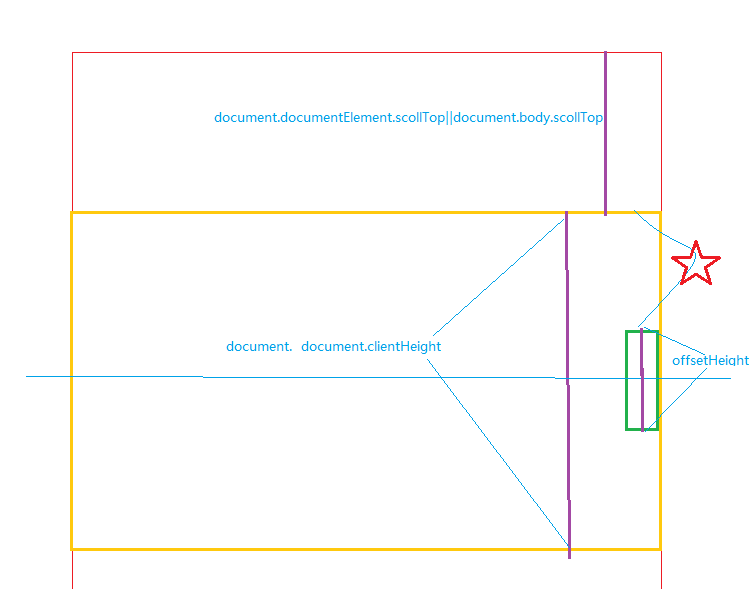

## 运动基础

### 运动基础

- 让div运动起来  offsetLeft
- 速度——物体运动的快慢
- 运动中的bug
  - 不会停止——定时器
  - 速度取某些值会无法停止——判断方法大于等于
  - 到达位置后再点击还会运动——if...else...
  - 重复点击速度加快——几个定时器同时工作，先关再开
- 匀速运动

### 运动框架及应用

- 运动框架

  - 在开始运动时，关闭已有定时器
  - 把运动和停止隔开(if/else)

- 运动框架实例

  - 例子1：“分享到”侧边栏

    通过目标点，计算速度值

  - 例子2：淡入淡出的图片

    用变量存储透明度

### 缓冲运动

- 逐渐变慢，最后停止

- 距离越远速度越大

  - 速度由距离决定
  - 速度=(目标值-当前值)/缩放系数

- 例子：缓冲菜单

  - Bug：速度取整//分别上下取整

  - 跟随页面滚动的缓冲侧边

    潜在问题：目标值不是整数时parseInt

 

### 匀速运动的停止条件

运动终止条件

- 匀速运动：距离足够近
- 缓冲运动：两点重合

### 多物体运动框架

- 多物体同时运动

  - 例子：多个Div，鼠标移入变宽
    - 单定时器，存在问题
    - 每个Div一个定时器

- 多物体运动框架

  - 定时器作为物体的属性

  - 参数的传递：物体、目标值

  - 例子：多个Div淡入淡出

    - 所有东西都不能公用
    - 属性与运动对象绑定：速度、其他属性值（如透明度等）

### 任意值运动框架

- offset属性的Bug
  - 有边框的Div变宽
    - 用currentStyle代替offset
- 原有运动框架的问题
  - 只能让某个值运动起来
  - 如果想让其他值运动起来，要修改程序
- 扩展的运动框架运动
  - 属性作为参数
  - 封装opacity
    - 小数的问题

### 仿Flash图片展示

- 效果思路

  - 两边的按钮——淡入淡出

  - 大图下拉——层级、高度变化

  - 下方的li——多物体淡入淡出

  - 下方的Ul——位置计算
- 左右按钮
  - 淡入淡出
    - 鼠标移到按钮上，按钮会消失
      - 层级问题
      - 按钮和遮罩上都得加上事件
- 下方Li效果
  - 点击切换大图——选项卡
  - Li淡入淡出——移入移出
  - Ul移动——位置计算
- 大图片切换
  - 图片层级——zIndex一直加1
  - 图片下拉效果(运动框架)
    - 可以改为淡入淡出
- 加入自动播放

### 链式运动框架

- 一个先变，然后另一个再变
- 回调函数
  - 运动停止时，执行函数
  - 运动停止时，开始下一次运动
  - 例子：土豆网右下角菜单

### 完美运动框架

- 多个值同时变化
  - setStyle同时设置多个属性
  - 参数传递
    - json的使用
    - for in遍历属性
- for...in和for循环
  - 数组：for...in(不灵活，只能全部循环)和for循环
  - json:for...in
- 运用到运动框架
- 检测运动停止
  - 标志变量
- 例子：伸缩同时淡入淡出的菜单
- move2.js

### 运动框架总结

运动框架演变过程

•startMove(iTarget)  运动框架

•startMove(obj, iTarget)  多物体

•startMove(obj, attr, iTarget)  任意值

•startMove(obj, attr, iTarget, fn)  链式运动

•startMove(obj, json)  多值运动

•startMove(obj, json, fn)  完美运动框架

### 运动框架应用

- 例子：多图片展开、收缩
  - 布局转换：浮动转换为绝对定位
  - z-index
- 例子：新浪微博
- 无缝滚动

### 弹性运动

- 加减速运动
  - 速度不断增加或减少iSpeed++
  - 速度减小到负值，会向反方向运动
- 弹性运动
  - 在目标点左边，加速；在目标点右边，减速

  - 根据距离，计算加速度

    iSpeed+=(300-oDiv.offsetLeft)/50

- 摩擦力

  - 速度不断减小iSpeed*=0.7;

- 带摩擦力的弹性运动
  - 弹性运动+摩擦力

- 弹性公式
  - 速度+=(目标值-oDiv.offsetLeft)/5
  - 速度*=0.7
- 例子
  - 仿官网导航条效果
    - 无法到达指定位置——小数误差问
    - 如何解决？速度无法取整，使用变态办法——变量
  - 弹性菜单
    - 弹性运动的问题：运动过界

### 碰撞运动

- 碰撞运动
  - 撞到目标点，速度反转
  - 无重力的漂浮Div
    - 速度反转iSpeedY*=-1;
    - 滚动条闪烁的问题
      - 过界后直接拉回来

- 加入重力
  - 反转速度的同时，减小速度iSpeedY*=-0.8;
  - 纵向碰撞，横向速度也减小
  - 横向速度小数问题（负数）
  - if(Math.abs(iSpeedX)<1){iSpeedX=0;  }

•为什么停在下面而不是左右上下

### 碰撞运动（二）

- 鼠标拖拽
  - 两点间距离求出速度

- 运动终止条件
  - 弹性运动：距离足够近 并且 速度足够小
  - 碰撞运动：距离足够近 并且 速度足够小